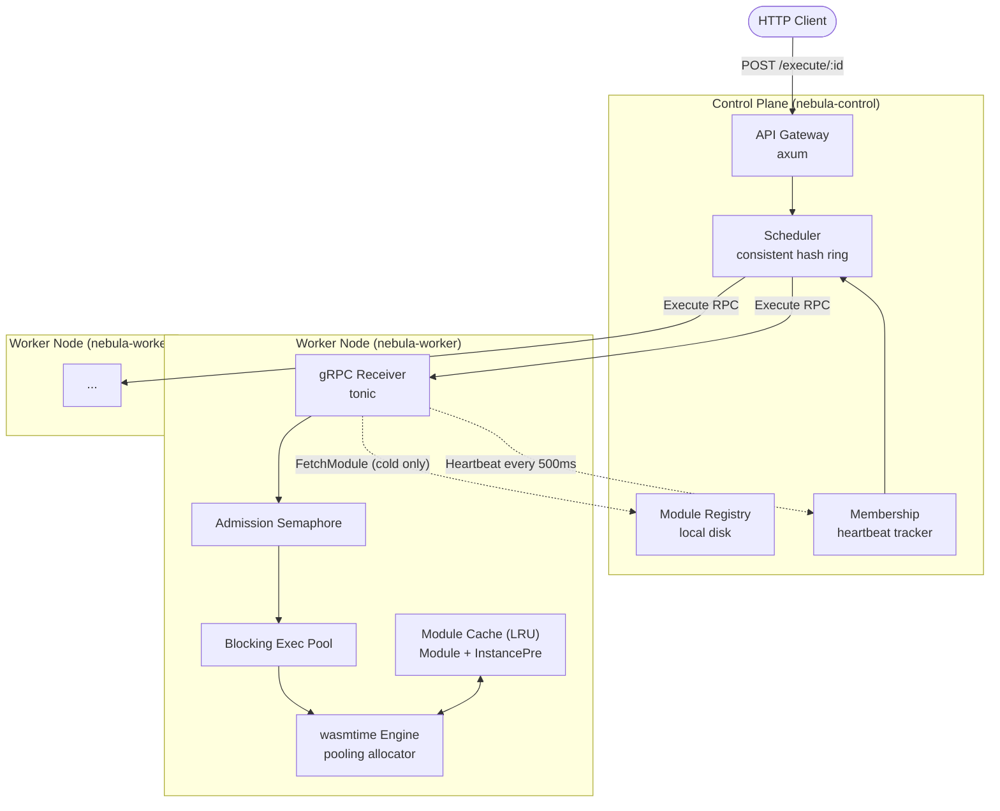

# Nebula — Design Document

**Project:** Distributed WebAssembly Serverless Runtime
**Author:** Anirudh Vemuri

---

## Table of Contents

1. [Motivation & Goals](#1-motivation--goals)
2. [Non-Goals](#2-non-goals)
3. [Architecture Overview](#3-architecture-overview)
4. [Request Lifecycle](#4-request-lifecycle)
5. [The Execution Core](#5-the-execution-core)
6. [Sandboxing & Resource Limits](#6-sandboxing--resource-limits)
7. [The Host Interface](#7-the-host-interface)
8. [Module Lifecycle & Caching](#8-module-lifecycle--caching)
9. [Distribution: Scheduling & Routing](#9-distribution-scheduling--routing)
10. [Fault Tolerance & Load Management](#10-fault-tolerance--load-management)
11. [Interfaces](#11-interfaces)
12. [Error Taxonomy](#12-error-taxonomy)
13. [Threat Model](#13-threat-model)
14. [Observability](#14-observability)
15. [Testing Strategy](#15-testing-strategy)
16. [Technology Stack](#16-technology-stack)
17. [Repository Layout](#17-repository-layout)
18. [Implementation Phases](#18-implementation-phases)
19. [Benchmark Methodology & Success Criteria](#19-benchmark-methodology--success-criteria)
20. [Risks & Open Questions](#20-risks--open-questions)
21. [Deferred Work](#21-deferred-work)
22. [Agent Ecosystem Integration](#22-agent-ecosystem-integration)

---

## 1. Motivation & Goals

Serverless platforms built on microVMs (Firecracker) or containers pay a
process-creation tax on every cold start: 200 ms to 1 s+. That tax exists
because the isolation boundary is the operating system, and constructing an OS
boundary is expensive.

WebAssembly moves the isolation boundary into the compiler. A WASM module is
memory-safe by construction, has no ambient authority, and instantiates in
microseconds rather than milliseconds. Nebula is a distributed, multi-tenant
compute engine that uses this to reach hot-start latencies three orders of
magnitude below a microVM platform.

### Goals

| # | Goal | Measured by |
|---|------|-------------|
| G1 | Sub-millisecond hot-start execution | p99 instantiate+execute of a trivial handler, in-process, < 1 ms |
| G2 | Cold start an order of magnitude below microVMs | p99 end-to-end cold start < 50 ms for a ≤ 2 MiB module |
| G3 | Safe execution of untrusted multi-tenant code | Adversarial guest corpus (§15) cannot crash, hang, or starve a worker |
| G4 | Deterministic, enforced resource ceilings | Every limit in §6 has a test that proves the trap fires |
| G5 | Survive node loss without operator action | Killing a worker under load reroutes traffic within 3 s, zero 5xx after reconvergence |
| G6 | Survive overload without cascading failure | At 5× capacity, the cluster sheds cleanly rather than OOMs |

### Design principles

- **Lean on the engine.** Wasmtime already solves AOT caching, CoW memory
  images, pooling allocation, and deterministic traps. Nebula's job is the
  distributed system around it, not a second-rate reimplementation of it.
- **Guest faults are data, not errors.** A trap is the expected outcome of
  running untrusted code. It flows back as a typed result, never as a
  transport-layer error.
- **Every phase ships something runnable.** Vertical slices, not horizontal
  layers.

---

## 2. Non-Goals

Explicitly out of scope. Each of these is a legitimate feature that Nebula
deliberately does not build, because building it would trade away the schedule
without teaching anything the project is about.

- **Not a container replacement.** No arbitrary syscalls, no `fork`/`exec`, no
  subprocess spawning, no raw sockets. Guests get the host interface in §7 and
  nothing else.
- **No side-channel resistance.** Wasmtime's sandbox enforces memory safety, not
  timing isolation. Spectre-class cross-tenant leakage is an accepted risk (§13).
- **No autoscaling or node provisioning.** The worker set is fixed and started
  manually. The control plane reacts to nodes joining and leaving; it does not
  create them.
- **No multi-region, no geo-routing, no edge PoPs.** Single cluster, single
  region.
- **No billing, quota accounting, or per-tenant cost metering.**
- **No guest-visible persistent storage** beyond the host key-value shim (§7),
  which is per-node and non-durable.
- **No WASM threads or SIMD-dependent guest features in v1.** Single-threaded
  guests only.
- **No user-facing identity system.** Tokens are HMAC-signed per tenant (§13)
  (§13); real authentication is a deployment concern, not a runtime one.

---

## 3. Architecture Overview

Two binaries, one gRPC mesh.



**Control Plane** — stateless with respect to execution; holds cluster
membership and the module registry. Horizontally replicable later, single
instance in v1.

**Worker Node** — owns a wasmtime `Engine`, a module cache, and a bounded
execution pool. Workers are interchangeable; the ring decides which one gets a
given function, and any worker can serve any function after a cold start.

The two components share nothing but the proto definitions. A worker never
talks to another worker.

---

## 4. Request Lifecycle

Three paths, distinguished by what the worker already has in memory.

### 4.1 Cold start — worker has never seen this module

1. **Ingress.** Gateway receives `POST /execute/{function_id}`, validates the
   bearer token and body size cap, assigns a request ID.
2. **Scheduling.** Scheduler hashes `function_id` onto the ring, selects the
   owning worker. Falls through to the next node on the ring if the owner is
   unhealthy.
3. **Dispatch.** `Execute` RPC to the worker with the function ID, a module
   content hash, and the request body.
4. **Cache miss.** Worker has no module for that hash. It issues a
   `FetchModule` server-streaming RPC back to the control plane's registry.
5. **Transfer.** Registry streams the artifact in 256 KiB chunks. Worker
   verifies the SHA-256 against the requested hash.
6. **Compile.** Worker checks its on-disk AOT cache
   (`Module::deserialize_file`). On miss, `Module::new` compiles, and the
   result is serialized to disk for next time. The `Module` is inserted into
   the LRU cache alongside a pre-resolved `InstancePre`.
7. **Execute.** Falls into the hot path below.

**Design note — why the worker pulls through the control plane rather than
from object storage.** In v1 the registry *is* local disk on the control plane
node, so there is nowhere else to pull from. This does put the control plane
on the data path for cold starts. It is acceptable because cold starts are
rare by construction (the ring pins functions to nodes) and the transfer is
one-shot per module per worker. When the registry moves to S3, workers pull
directly and the control plane leaves the data path entirely.

### 4.2 Hot start — module compiled and cached

1. Ingress and scheduling as above; the ring routes to the same worker.
2. **Cache hit.** LRU lookup by content hash returns the `InstancePre<HostCtx>`.
3. **Admission.** Acquire a permit from the concurrency semaphore. No permit
   available → shed immediately (§10.3).
4. **Instantiate.** A fresh `Store` is created and `InstancePre::instantiate`
   allocates an instance from the pooling allocator. Imports are already
   resolved; linear memory comes from a CoW mapping of the module's memory
   image. No compilation, no import resolution, no page zeroing.
5. **Execute.** The call runs on the blocking execution pool (§5.2) under an
   epoch deadline. Result is copied out of guest memory.
6. **Teardown.** `Store` is dropped, the instance slot returns to the pool, and
   the CoW mapping is discarded — dirtied pages are dropped, not scrubbed, so
   no cross-request state can survive.

**Every request gets a fresh `Store` and a fresh instance.** The cached object
is the compiled `Module`/`InstancePre`, which is immutable and `Send + Sync`.
Instances are never reused across requests in v1; this is what makes tenant
isolation trivially correct.

### 4.3 Pre-initialized start — heavy guest runtimes

Compiling is fast; *booting* is not. A guest embedding a language runtime or a
framework may spend tens of milliseconds in `_initialize` allocating its heap
before it ever sees a request. Paying that on every instantiation defeats the
point.

**This is solved at build time, not at run time.**
[Wizer](https://github.com/bytecodealliance/wizer) runs the module's
`_initialize` ahead of time and snapshots the resulting linear memory *back
into the module's own data segments*, emitting a new `.wasm`. Wasmtime then
does the rest for free: with `memory_init_cow` enabled (the default), the
module's memory image is mmap'd copy-on-write into every new instance.

So the "zero-boot-time path" is:

- **Deploy time:** `wizer input.wasm -o initialized.wasm`, store the
  pre-initialized artifact in the registry.
- **Run time:** nothing. It is the hot path from §4.2, and the boot cost is
  already paid.

**The runtime needs no flag for this, and does not have one.** Wizer drops the
init export after consuming it, so the runtime rule is simply the WASI reactor
convention: *call `_initialize` if the module exports it, then call the
handler*. A raw module still exports it and pays the boot on every request; a
wizened module does not export it and there is nothing to call. One code path,
and the export's absence is the entire signal.

**Measured** (`crates/nebula-runtime/tests/wizer_bench.rs`, `heavy_init` guest —
a 200k sieve kept on the heap plus a hash chain, ~22 ms of boot):

| | Median execution | Share of the 50 ms deadline |
|---|---|---|
| Raw | 20.5 ms | 41% |
| Wizened | 0.25 ms | 0.5% |
| | **~80× faster** | |

Both emit an identical result, which the test asserts — a module that skipped
the work would otherwise look like a win. The share-of-budget column is the
operationally interesting half: the raw guest burns two fifths of its request
budget before the handler starts, and roughly 2.4× this boot cost would exceed
the deadline outright and fail the request.

> **Superseded:** the original spec proposed freezing and `mmap`-ing linear
> memory snapshots inside the worker. That is a reimplementation of
> `memory_init_cow`, and the hard part — capturing post-`_initialize` state as
> something a fresh instance can start from — is exactly what Wizer does. Cut.

---

## 5. The Execution Core

`nebula-runtime` is a standalone library crate with no networking. It owns the
wasmtime embedding and knows nothing about gRPC, HTTP, or clustering. The
worker binary is a thin shell around it. This is what makes the sandbox
testable and benchmarkable without a cluster.

### 5.1 Engine configuration

One `Engine` per process, shared across all tenants. Engine construction is
expensive; instance creation is not.

```rust
let mut cfg = Config::new();
cfg.epoch_interruption(true);           // wall-clock deadlines (§6.1)
cfg.consume_fuel(false);                // opt-in per function (§6.2)
cfg.memory_init_cow(true);              // CoW memory images (§4.3)
cfg.max_wasm_stack(512 * 1024);         // bound guest stack depth
cfg.wasm_threads(false);                // single-threaded guests only
cfg.cranelift_opt_level(OptLevel::Speed);
cfg.allocation_strategy(InstanceAllocationStrategy::Pooling(pooling_cfg()));
```

The **pooling allocator** is what makes G1 reachable. It pre-reserves instance
slots, linear memory regions, and tables at startup, so instantiation is a slot
handoff plus an mmap rather than a set of fresh allocations. It also gives a
hard ceiling on concurrent instances, which is a resource limit in its own
right (§6.4).

> **API versions.** Names above track the wasmtime 2x series. Pin one exact
> version in `Cargo.toml` at the start of Phase 1 and verify each call against
> that version's docs — this API surface moves between releases (`add_fuel` →
> `set_fuel`, WASI p1 → p2 bindings). Do not upgrade mid-phase.

### 5.2 Execution is blocking work, not async work

**This is the single most important structural decision in the runtime.**

A WASM call is synchronous, CPU-bound, and may run for the full epoch deadline.
Calling it directly from a tokio task pins an async worker thread for the whole
duration. With a default multi-threaded runtime of N threads, N concurrent
executions stall the reactor: heartbeats stop, health checks time out, the
control plane declares a healthy node dead, and load sheds off a node that is
merely busy. Under sustained load this is indistinguishable from a crash.

Nebula therefore keeps two thread populations:

- **The async runtime** (`tokio`, default worker count) handles gRPC framing,
  registry streaming, heartbeats, and admission control. It never blocks.
- **The execution pool**, a dedicated fixed-size pool sized to available cores,
  runs `Store` creation, instantiation, and the guest call. Work is handed to
  it over a bounded channel; the async side awaits a `oneshot` for the result.

A bounded channel is deliberate: a full channel is the backpressure signal that
feeds admission control (§10.3). Queue depth is itself an SLI.

The `Store<HostCtx>` never crosses an `.await`. It is created, used, and
dropped entirely inside one pool task.

> `tokio::task::spawn_blocking` is the obvious first implementation and is
> correct. It is rejected as the *final* design only because its pool is
> unbounded by default and shared with other blocking work, which erases the
> backpressure signal. Phase 1 uses `spawn_blocking`; Phase 3 replaces it with
> the dedicated bounded pool when load shedding lands.

### 5.3 Async host functions

Host functions that perform I/O (the KV shim, future outbound HTTP) present a
mismatch: the guest call is synchronous, but the host work is async. Two
options:

1. **Block inside the host function** on a channel round-trip to the async
   runtime. Simple, correct, and the executing thread is a pool thread that is
   *supposed* to block — it costs nothing that matters.
2. **`Config::async_support(true)`** with `call_async`, which requires guest
   execution on the async runtime and reintroduces §5.2's problem.

**Decision: option 1.** Synchronous engine; host functions block on a channel
round-trip to the async side when they need I/O. Revisit only if host I/O
becomes a measured bottleneck.

---

## 6. Sandboxing & Resource Limits

The guest is assumed hostile. Every dimension along which it could consume
unbounded resources has an explicit ceiling and a test that proves the ceiling
fires (§15).

### 6.1 CPU time: epoch interruption (default)

A background ticker thread calls `Engine::increment_epoch()` on a fixed
interval. Each `Store` is given a deadline in ticks via
`Store::set_epoch_deadline`. Wasmtime emits a cheap counter check at loop
back-edges and function entries; exceeding the deadline raises a trap that
unwinds the guest without touching the host.

- **Tick interval:** 1 ms. This is also the deadline granularity — a 50 ms
  budget is enforced to within ±1 ms.
- **Overhead:** a relaxed atomic load and compare on back-edges. Negligible.
- **Not deterministic:** the same input can consume different wall-clock time
  across runs. Accepted for the default path.

### 6.2 CPU instructions: fuel (opt-in)

`Config::consume_fuel(true)` plus `Store::set_fuel(n)` charges every instruction
against a budget, trapping deterministically at zero. Identical input always
traps at the identical instruction.

Fuel costs 1.3–2× throughput on compute-bound code, because metering is
instrumented into the compiled output. That is too expensive to impose on every
tenant for a guarantee most do not need.

**Decision: epochs are the default; fuel is a per-function opt-in** for
workloads that need reproducibility (replay, deterministic simulation,
instruction-count billing, and the stateful actors of §21 if they land).
Enabling fuel requires a separate `Engine` — `consume_fuel` is engine-level
config baked into compiled code — so the worker holds two engines and routes by
function metadata.

> **Superseded:** the original spec made fuel the sole CPU mechanism. Fuel
> answers "how many instructions did this execute," which is not the question a
> request timeout asks.

### 6.3 Memory

Linear memory grows in 64 KiB pages. Growth requests are intercepted by a
`ResourceLimiter` installed on the `Store`:

```rust
let limits = StoreLimitsBuilder::new()
    .memory_size(128 << 20)   // 128 MiB hard ceiling
    .memories(1)
    .instances(1)
    .tables(1)
    .table_elements(10_000)
    .build();
store.limiter(|ctx| &mut ctx.limits);
```

A `memory.grow` beyond the ceiling returns `-1` to the guest per the WASM spec.
A well-written guest handles this; a naive one traps on the subsequent access.
Both are contained.

Under the pooling allocator, per-slot memory reservation is configured on
`PoolingAllocationConfig` and must be ≥ the `StoreLimits` ceiling, or
instantiation fails before the limiter ever runs.

**The two numbers are deliberately different, not one constant used twice.** The
pooling slot (`POOL_MAX_MEMORY_BYTES`, 256 MiB) is the largest ceiling any
function may ever be granted, because the slot is a fixed reservation made at
startup. `StoreLimits` (`MAX_MEMORY_BYTES`, 128 MiB default) is *this function's*
policy, and is what per-function registry overrides will vary. Setting them equal
has a specific failure mode: the pool silently enforces the same number, so
dropping the per-store limiter changes nothing observable and no test catches it.
Keeping the slot strictly above the default ceiling makes the limiter the binding
constraint and the pool the backstop — see
`store_limiter_refuses_growth_the_pooling_slot_would_allow`, which fails if the
limiter is ever removed.

### 6.4 Full limit table

| Dimension | Mechanism | v1 default |
|---|---|---|
| Wall-clock CPU | epoch deadline | 50 ms |
| Instructions (opt-in) | fuel | 1 × 10⁹ |
| Linear memory (per function) | `StoreLimits` | 128 MiB |
| Linear memory (pooling slot reservation) | `PoolingAllocationConfig` | 256 MiB |
| Guest stack | `Config::max_wasm_stack` | 512 KiB |
| Table elements | `StoreLimits` | 10 000 |
| Instances per `Store` | `StoreLimits` | 1 |
| Concurrent instances per worker | pooling `total_memories` | 64 |
| Concurrent executions per worker | admission semaphore | = pool size |
| Request body | axum `DefaultBodyLimit` | 1 MiB |
| Response body | host-side cap on guest write | 1 MiB |
| Module artifact size | registry validation at deploy | 32 MiB |
| Total request incl. host I/O | tokio `timeout` at gateway | 100 ms |
| KV entries / bytes per node | host shim caps | 10 000 / 16 MiB |
| KV key / value size | host shim caps | 1 KiB / 64 KiB |
| Captured stdout+stderr per request | `MemoryOutputPipe` capacity | 64 KiB each |

Every default is a named constant in one config module, overridable per
function through registry metadata. No magic numbers at call sites.

---

## 7. The Host Interface

A WASM guest has no ambient authority. It can compute, and it can call imports
the host chose to provide. The set of imports *is* the security policy.

### 7.1 WASI

WASI preview 1 via `wasmtime-wasi`, with a deliberately minimal `WasiCtx`:

- **stdout / stderr:** captured to per-request in-memory buffers, surfaced as
  structured log fields. Never inherited from the host.
- **stdin:** the request body. A guest that must survive Wizer imports
  nothing but WASI (R2) and so cannot call `nebula.request_read`; the
  interpreter guests of §22.1 read their source from here.
- **Filesystem:** no preopened directories. Every path operation fails.
- **Clocks:** coarse monotonic and wall clock. See §13 on timing.
- **Random:** host CSPRNG.
- **Environment / args:** only what the registry entry declares, never the
  host's real environment.
- **Sockets:** absent.

WASI preview 2 / the component model is the eventual destination and gives a
much better story for typed host interfaces. It is not v1: preview 1 is what
every current guest toolchain reliably emits.

### 7.2 Nebula host functions

Registered on the `Linker` under the `nebula` module namespace:

| Import | Signature | Purpose |
|---|---|---|
| `nebula.request_len` | `() -> i32` | Size of the pending request body |
| `nebula.request_read` | `(ptr: i32, len: i32) -> i32` | Copy request body into guest memory |
| `nebula.response_write` | `(ptr: i32, len: i32) -> i32` | Append to the response buffer (capped) |
| `nebula.kv_get` | `(kptr, klen, vptr, vlen) -> i32` | Read from the node-local KV shim |
| `nebula.kv_set` | `(kptr, klen, vptr, vlen) -> i32` | Write to the node-local KV shim |
| `nebula.log` | `(level: i32, ptr, len)` | Emit a structured log line |
| `nebula.http_get` | `(uptr, ulen, optr, olen) -> i32` | Outbound HTTP, allowlisted and off by default (§22.8) |

The interpreter guest wraps the last three as `session.get`, `session.set`, and
`httpGet` (§22.1).

The KV shim is **node-local and non-durable** — a `DashMap` keyed by
`(tenant, session, key)` *tuples*, not by a concatenated prefix, and bounded per
§6.4. The tuple matters: a delimiter scheme needs an argument about escaping
before you can believe one tenant cannot spell its way into another's namespace,
and a tuple needs none.

A guest may only assume a write is visible on the next request when the caller
sends the same `X-Nebula-Partition-Key` (§22.5), which is what routes both
requests to the same worker. Without one, the session is `""` and the old rule
stands: do not assume. Entries expire after 10 minutes, refreshed on write —
caps without an expiry are caps that become permanent.

The response body is what the guest wrote through `response_write`, or its
captured **stdout** when it wrote nothing there — the same reason stdin carries
the request. It is a fallback rather than a merge because two channels landing
in one body would interleave by flush order, which is not a contract a caller
can use. stdout is capped at 64 KiB, so that is the ceiling on a stdout-answered
response.

Integer returns across the `nebula` namespace follow one convention: a
non-negative count on success, `-1` on refusal. A refusal (store full, item
oversized) is a recoverable condition the guest can handle — the precedent is
WebAssembly's own `memory.grow` returning `-1`. Traps are reserved for a guest
that hands the host an invalid pointer, which is not recoverable. Silent
truncation is used only where the guest can detect it: `kv_get` returns the
value's full length even when it wrote fewer bytes, and `response_write` returns
the count it accepted.

### 7.3 Memory translation

Guest pointers are `u32` offsets into the guest's own linear memory. They are
attacker-controlled and mean nothing to the host until validated.

Every host function that touches guest memory goes through one helper:

```rust
fn guest_slice<'a>(caller: &'a mut Caller<'_, HostCtx>, ptr: u32, len: u32)
    -> Result<&'a mut [u8], Trap>
{
    let mem = caller.get_export("memory")
        .and_then(Extern::into_memory)
        .ok_or(Trap::MemoryOutOfBounds)?;
    let data = mem.data_mut(caller);
    let end = (ptr as usize).checked_add(len as usize)   // overflow -> trap
        .ok_or(Trap::MemoryOutOfBounds)?;
    data.get_mut(ptr as usize..end).ok_or(Trap::MemoryOutOfBounds)
}
```

**One function. Every host call routes through it. No exceptions.** Checked
arithmetic on the bound, a slice index that cannot reach outside the memory,
and a trap on any failure. Borrows are never held across a guest re-entry —
`memory.grow` may reallocate the backing store and invalidate them.

This is a trust boundary and is not subject to simplification. It gets direct
unit tests for `ptr + len` overflow, `ptr` past the end, `len` past the end,
zero-length at the boundary, and a post-`grow` re-borrow.

---

## 8. Module Lifecycle & Caching

### 8.1 Identity

Modules are addressed by **SHA-256 of the artifact bytes**, not by
`function_id`. `function_id` is a mutable pointer to a content hash held in the
registry. This makes the cache trivially correct across deploys: a new version
is a new hash and a new cache entry; the old one ages out. No invalidation
protocol, no staleness window, no cache-busting RPC.

### 8.2 Three cache tiers

| Tier | Contents | Scope | Populated by |
|---|---|---|---|
| L1 — memory | `Module` + `InstancePre<HostCtx>` | Per worker process | Compile or AOT load |
| L2 — disk | `Module::serialize()` bytes | Per worker node, survives restart | First compile |
| L3 — registry | Original `.wasm` artifact | Cluster | Deploy |

A cold start walks L1 → L2 → L3, populating on the way back down. A worker
restart replays from L2 and skips Cranelift entirely.

`Module::deserialize` is `unsafe` — it maps precompiled machine code and trusts
its provenance. The L2 cache is keyed by
`sha256(artifact) + wasmtime_version + engine_config_hash + target_triple`, and
a mismatch on any component is a miss, not a load. Nothing outside the worker
can write to it.

### 8.2.1 Both disk stores are bounded

An earlier cut bounded L1 by bytes and left L2 and the registry unbounded, which
made them a disk that fills rather than a cache that evicts.

**L2** has a 4 GiB budget, swept when a compile writes to it, evicting least
recently used first. Recency is the file's modification time, refreshed on every
hit, so it is an LRU with no index to keep in sync and nothing to rebuild after a
restart. Only a compile can grow L2, so that is the only place it needs
checking, and compiles are rare by construction.

**The registry** collects artifacts nothing points at. Content addressing means a
redeploy never overwrites: it writes a new file and leaves the old one, so fifty
deploys of one function leave fifty artifacts. Collection runs after a deploy,
since that is the only event that can orphan one.

Two details that are not decoration. An artifact must be unreferenced **and
older than an hour** before it goes: a deploy dereferences the previous version
immediately, while a worker that began streaming it a moment ago (§4.1) is still
reading, and deleting underneath that worker turns a cold start into an
`INTERNAL`. And only files named `<64 hex>.wasm` are candidates, so
`deployments.json` is never one. Losing that file would look exactly like every
function vanishing at once.

### 8.3 The LRU cache

`Module` is `Send + Sync` and internally reference-counted, so the cache holds
`Arc<CachedModule>` and clones are cheap. A `Mutex<LruCache<Hash, Arc<..>>>`
guards the map; the lock is held only for lookup and insert, never across
compilation or execution.

**Eviction is bounded by memory, not entry count.** A count-based cache holding
sixty 30 MiB modules is an OOM. Each entry's cost is estimated from its
serialized size; the cache evicts LRU-first until the total is under a
configured budget (default 1 GiB).

Concurrent cold starts for the same hash must not compile the same module N
times. A per-hash in-flight map lets the first request compile while the rest
await a broadcast — the standard single-flight pattern, roughly twenty lines.

`InstancePre` is built once at insert. It resolves and type-checks every import
ahead of time, so per-request instantiation skips the entire linking step. This
is a meaningful fraction of the hot-path budget and is free to adopt.

---

## 9. Distribution: Scheduling & Routing

### 9.1 Consistent hashing

The scheduler maps `function_id` onto a hash ring so that repeated requests for
a function reach the same worker, converting what would be a cluster-wide cold
start into a single one.

```
ring: BTreeMap<u64, NodeId>          // virtual node hash -> physical node

insert(node):  for i in 0..V { ring.insert(hash(node.id, i), node) }
lookup(key):   ring.range(hash(key)..).next()
                   .or_else(|| ring.iter().next())   // wrap the ring
                   .map(|(_, n)| n)
```

Stdlib `BTreeMap::range` is the whole algorithm. No crate, no sorted-vec
maintenance, no binary search to write.

**Virtual nodes (V = 160 per physical node) are mandatory, not an
optimization.** With one point per node, a 4-node cluster produces arc lengths
that differ by 3–4×, and one worker takes the majority of traffic. The original
spec's "hash the `function_id` to a node" is only balanced with virtual nodes
present.

**What V = 160 actually buys, measured.** Consistent hashing's load imbalance
falls off as roughly `1/√V`, so V = 160 gives about 8% — not "a few percent",
as an earlier draft of this document claimed. Over 200 key sets of 10 000 keys
on a 3-worker ring:

| median | p90 | max | over 10% |
|---|---|---|---|
| 8.0% | 9.9% | 11.6% | 17 of 200 |

So a 10% spread is the **typical** case at V = 160, not a guarantee, and a test
asserting 10% against a single key set is a coin flip that lands right about
11 times in 12. `crates/nebula-control/src/ring.rs` therefore keeps the
single-key-set assertion the requirement asks for *and* a sweep that asserts the
median, so a genuine regression is distinguishable from an unlucky draw.

Raising V is the lever if a hard worst-case bound is ever needed: the error
shrinks as `1/√V`, so a 10% worst case wants V ≈ 640. That is a deliberate
trade — 640 points per node makes ring rebuilds and memory four times heavier —
and §9.2's bounded-load check is the cheaper answer to the same problem, since
it corrects hotspots at request time rather than trying to eliminate them
structurally.

**Hashing.** The ring uses stdlib `DefaultHasher`. That is sound only while the
control plane is a single process (§2): the ring is rebuilt in memory from live
membership, never persisted and never compared across processes, so the hash
only has to be stable within one run — and `DefaultHasher` is explicitly not
stable across Rust releases. Replacing it with a fixed hash (§16 names xxhash)
is a prerequisite for replicating the control plane, not an optimization;
without it two instances on different toolchains would disagree about routing
and silently split the keyspace.

**Failover:** if the owning node is unhealthy, walk the ring to the next
*distinct* physical node. This is deliberately not replication — the second
node cold-starts. Correct, slower, and one line. Pre-warming replicas is
deferred (§21).

**Rebalance cost:** adding or removing a node remaps only ~1/N of the keyspace,
which is the entire reason for consistent hashing over `hash % N`.

### 9.2 Scheduling with load awareness

Pure consistent hashing routes by identity alone and will happily hammer a
saturated node while its neighbour idles. The scheduler therefore tracks each
worker's reported in-flight count (piggybacked on heartbeats) and applies
**bounded load**: if the ring's chosen node is above `c ×` mean cluster load
(`c = 1.25`), advance to the next node on the ring. This preserves cache
affinity in the common case and bleeds off hotspots at the tail.

---

## 10. Fault Tolerance & Load Management

### 10.1 Membership and liveness

Workers register with the control plane at startup, then send a **unary
`Heartbeat` RPC every 500 ms** carrying in-flight count, queue depth, cache
occupancy, and their generation ID.

The control plane records `last_seen: Instant` per node. A reconciliation task
runs every 500 ms and marks any node whose `last_seen` exceeds 1.5 s (three
missed beats) as unhealthy, removing its virtual nodes from the ring.

> **Superseded:** the original spec called for bidirectional gRPC streaming. A
> unary beat plus a timestamp is strictly simpler and detects *more* failure
> modes — a stream stays open through a wedged process or a stop-the-world
> pause, and reconnect logic is a whole state machine to get wrong. A stale
> timestamp catches process death, network partition, and livelock identically.

A **generation ID** (random per process start) lets the control plane detect a
worker that died and restarted between beats, so it can drop stale routing
state rather than assume continuity.

Recovery is symmetric: heartbeats resuming re-adds the node to the ring. No
operator action, no manual drain.

### 10.2 Failure handling on the request path

| Failure | Handling |
|---|---|
| Connection refused / DNS failure | Retry once on the next ring node. Safe: the request was never sent. |
| Timeout after send | **No retry.** The guest may have run and had effects. Return 502. |
| `RESOURCE_EXHAUSTED` (shed) | Try one more ring node, then 503 + `Retry-After`. |
| Guest trap / timeout / OOM | Not a failure of Nebula. Typed outcome, mapped per §12. |

**Retrying only on connection-establishment failure is a correctness decision,
not a tuning knob.** Nebula cannot know whether a guest's host calls were
idempotent, so it must not re-execute anything that may already have run.

### 10.3 Load shedding and backpressure

Little's Law: `L = λW`. Latency `W` grows without bound only if concurrency `L`
is unbounded at a given arrival rate `λ`. Bounding `L` bounds `W`. So the
control is a **concurrency limit, not a latency threshold**:

- **Worker admission.** A `tokio::sync::Semaphore` sized to the execution pool.
  `try_acquire` fails → return `RESOURCE_EXHAUSTED` immediately. Shedding is
  *fast*; a shed request costs microseconds and never touches the engine.
- **Queue bound.** The channel into the execution pool is bounded. A full
  channel is a second, earlier shed signal.
- **Gateway.** Translates `RESOURCE_EXHAUSTED` into `503` with `Retry-After`,
  after one attempt at the next ring node. It does not queue and does not
  retry-storm.

A p99-latency trigger measures the symptom after the queue has already filled;
the semaphore prevents the queue from filling. It is also fewer moving parts —
no histogram, no windowing, no controller to tune.

> `ponytail:` static concurrency limit. If measurement shows the right limit
> varies with workload mix, upgrade to an AIMD/Vegas-style adaptive limiter
> (the `tower` ecosystem has one). Not before.

### 10.4 What is deliberately not built

Circuit breakers, hedged requests, priority request queues, and speculative
retries are all absent. Each adds failure modes of its own, and none of them is
on the path to any goal in §1.

---

## 11. Interfaces

### 11.1 HTTP (client-facing)

```
POST /execute/{function_id}
  Authorization: Bearer <tenant-token>
  Content-Type: application/octet-stream
  X-Nebula-Deadline-Ms: <opt, 10..5000, default 50>
  X-Nebula-Partition-Key: <opt, routes and namespaces a session, §22.5>
  Idempotency-Key: <opt, 1..=255 bytes; replays an answer for 60s, §22.4>
  traceparent: <opt, W3C trace context; adopted or minted, §22.6>
  Body: <= 1 MiB
  ->  200 <response body>
      X-Nebula-Cold: true|false
      X-Nebula-Exec-Micros: <n>
      X-Nebula-Deadline-Ms: <the effective budget, after clamping>
      X-Nebula-Trace-Id: <this request's trace, on every response, §22.6>
  ->  4xx/5xx
      X-Nebula-Fault: <machine-readable cause, always present>
```

**`X-Nebula-Deadline-Ms` exists for tool-calling clients.** The 50 ms default of
§6.4 suits a web handler and starves an agent asking a sandbox to do real work.
The value is clamped to `[10, 5000]` and the *effective* budget is echoed on the
response, so a caller that asked for 60 s learns it got 5 s rather than reading
the resulting `timeout` fault as a bug in its own code. A malformed header is a
`400` with `X-Nebula-Fault: invalid_deadline`, not a silent fall back to the
default — defaulting would hand a client that asked for seconds a 50 ms budget
and then a timeout it cannot diagnose. The worker clamps independently
(`MAX_DEADLINE_MS`): a gateway is not a trust boundary the worker relies on.

**`X-Nebula-Fault` is on every non-200 response.** Status codes collide — `503`
is both "no worker in the ring" and "worker shed", `500` is both a guest trap
and a memory ceiling — so a client branching on status alone cannot tell them
apart. The header names the cause:

| Fault | Status | Meaning |
|---|---|---|
| `trap` | 500 | Guest trapped; detail in the body |
| `memory_limit` | 500 | Guest hit its linear-memory ceiling (§6.3) |
| `timeout` / `fuel_exhausted` | 504 | Guest exceeded its budget (§6.1–6.2) |
| `internal` | 500 | Host-side failure; detail withheld (§12) |
| `unknown_function` | 404 | Nothing deployed under that id |
| `module_not_found` | 404 | Deployed, but the artifact is missing from the registry |
| `unauthorized` | 401 | Missing or malformed bearer token |
| `invalid_deadline` / `invalid_request` / `invalid_idempotency_key` / `invalid_partition_key` | 400 | Caller's request is malformed |
| `idempotency_in_flight` | 409 | A request with this `Idempotency-Key` is still running (§22.4) |
| `rate_limited` | 429 | This tenant is ahead of its own budget; carries `Retry-After` (§22.7) |
| `no_healthy_worker` | 503 | The ring is empty |
| `no_reachable_worker` | 503 | No candidate accepted a connection; nothing ran |
| `cluster_at_capacity` / `worker_shed` | 503 | Admission control refused (§10.3) |
| `worker_unreachable` | 502 | Sent, then the connection failed; may or may not have run (§10.2) |

Every `503` and `429` carries `Retry-After`. `502` deliberately does not —
§10.2 forbids retrying a request that may already have executed, and inviting a
retry would undo that. An `Idempotency-Key` does **not** change this: the gateway never
received an answer to replay, so the retry is exactly as unsafe as before
(§22.4).

```

PUT  /functions/{function_id}      # deploy: body is the .wasm artifact
     X-Nebula-Tool-Schema: <opt, JSON descriptor, <= 16 KiB, §22.2>
     -> 201 { "content_hash": "...", "wizened": bool, "described": bool }
     # no compile timing: compilation happens lazily on the worker, not here
GET  /healthz                      # gateway liveness
GET  /cluster                      # node list, ring occupancy, per-node load
GET  /tools                        # tool descriptors for agent clients (§22.2)

# Designed, not built. Recorded rather than deleted because both are wanted and
# neither is blocked -- they are simply not yet earned by a caller.
GET  /functions/{function_id}      # metadata
GET  /metrics                      # Prometheus exposition
```

### Where compilation happens, and why not here

**The control plane does not depend on `wasmtime`, and that is a deliberate
architectural boundary rather than an omission.** An earlier draft of this
section claimed deploy-time `Module::validate` and that "compilation errors
surface at deploy, not on a user's first request." That was never implemented
and is now retracted: it would have required the engine on the control plane,
which is the one thing this split exists to prevent.

Deploy-time work on `PUT` is therefore everything that does *not* need a
compiler:

| Stage | Where | What it costs |
|---|---|---|
| Size cap (32 MiB) and `function_id` shape | Control plane | A comparison |
| Export-section parse (`wasmparser`) | Control plane | A linear scan, no codegen |
| Wizer pass, if the module exports `_initialize` | Control plane, **subprocess** | One guest boot |
| SHA-256, registry write, `deployments.json` | Control plane | One hash, two writes |
| **Cranelift compilation** | **Worker, lazily, on first execution** | Cached in L1 and L2 (§8.2) |

Three reasons the compiler stays on the data plane:

1. **Blast radius.** Cranelift compiling a hostile artifact is the largest
   attack surface in the system. A compiler bug on a worker costs one
   replaceable node; the same bug on the control plane costs cluster routing,
   membership, and the registry at once.
2. **Compilation is CPU-bound work, and §5.2 already solved that** — on the
   worker, behind a bounded pool and an admission semaphore. Doing it on the
   control plane would put unbounded CPU work on the reactor that also serves
   heartbeats, which is the exact failure §5.2 exists to prevent.
3. **It would be compiled twice anyway.** A worker's L2 cache is keyed by the
   engine's own compatibility hash (§8.2), so a control-plane artifact is not
   reusable by a worker with a different wasmtime build or target. Compiling at
   deploy would be work thrown away.

The cost of this choice is honest and worth stating: **a malformed artifact
deploys `201` and fails on the first worker that tries it**, surfacing as
`INTERNAL` (§12) rather than as a `400`. If that trade stops being acceptable,
the fix is not to move the compiler — it is to have a *worker* validate on
deploy and report back, keeping the engine on the data plane where it belongs.

**One caveat, because the principle is "no untrusted execution on the control
plane" and Wizer bends it.** Wizer instantiates the guest and runs its
`_initialize`, so a tenant's code does execute on the control-plane host. It is
meaningfully contained — a separate process, `--allow-wasi` with no preopened
directories, and a crash takes the subprocess rather than the control plane —
but it is guest execution, not merely inspection. §13 records it as an accepted
risk. Moving the Wizer pass onto a worker is the clean answer if that stops
being acceptable, and it costs nothing architecturally: Wizer's output is just
bytes, and the artifact must be hashed after it either way.

**Deployment persistence.** The `function_id` → content-hash table lives in
`deployments.json` in the registry directory, written via a temporary and a
rename before the `PUT` is acknowledged — a client told its function is
deployed must not lose it to a restart a moment later. It is one file for the
whole table rather than a file per function, deliberately: a `function_id`
arrives from a URL, and the surest way not to have to defend it against path
traversal is never to put it in a path. A corrupt or unknown-version table is
an error that stops startup, not something to shrug off into an empty map —
silently starting empty would look like every function vanishing for no reason.

### 11.2 gRPC (internal)

```proto
service NebulaWorker {
  rpc Execute(ExecuteRequest) returns (ExecuteResponse);
  rpc Drain(DrainRequest) returns (DrainResponse);   // graceful shutdown
}

service NebulaControl {
  rpc Register(RegisterRequest) returns (RegisterResponse);
  rpc Heartbeat(HeartbeatRequest) returns (HeartbeatResponse);
  rpc FetchModule(FetchModuleRequest) returns (stream ModuleChunk);
}

message ExecuteRequest {
  string function_id   = 1;
  string content_hash  = 2;   // worker fetches if not cached
  bytes  body          = 3;
  string request_id    = 4;
  uint32 deadline_ms   = 5;
  optional string partition_key = 6;   // reserved, §21
}

message ExecuteResponse {
  Outcome outcome      = 1;
  bytes   body         = 2;
  string  fault_detail = 3;   // trap reason, empty on OK
  uint64  exec_micros  = 4;
  bool    cold         = 5;
  uint64  fuel_used    = 6;   // 0 when fuel disabled
}

enum Outcome {
  OK = 0; TRAP = 1; TIMEOUT = 2; FUEL_EXHAUSTED = 3;
  MEMORY_LIMIT = 4; MODULE_NOT_FOUND = 5; INTERNAL = 6;
}

message ModuleChunk { bytes data = 1; uint64 offset = 2; bool last = 3; }
```

**Guest faults are `Outcome` values inside a successful RPC, never gRPC status
codes.** A tenant's infinite loop is a normal Tuesday; it must not appear in
transport error rates, must not trip retry logic, and must not be
indistinguishable from a worker crash on a dashboard. gRPC error statuses are
reserved for things that are genuinely Nebula's fault.

---

## 12. Error Taxonomy

| Condition | `Outcome` / gRPC status | HTTP | Notes |
|---|---|---|---|
| Success | `OK` | 200 | |
| Guest trap (unreachable, OOB, div-by-zero) | `TRAP` | 500 + `X-Nebula-Fault: trap` | Detail in body |
| Epoch deadline exceeded | `TIMEOUT` | 504 | |
| Fuel exhausted | `FUEL_EXHAUSTED` | 504 | Only when opted in |
| Memory ceiling hit | `MEMORY_LIMIT` | 500 + `X-Nebula-Fault: memory_limit` | Guest's own fault; 5xx by convention |
| — | — | — | *The limiter records its refusal on the store (`engine::Limits`), and a failed execution after one is tagged `MemoryLimitExceeded`. Without that, a guest refused memory and then dereferencing the pointer reports `TRAP` — the symptom, not the cause.* |
| Unknown `function_id` | `MODULE_NOT_FOUND` | 404 | |
| Artifact fails validation at deploy | `INVALID_ARGUMENT` | 400 | Deploy path only |
| Artifact > 32 MiB / body > 1 MiB | — | 413 | Gateway-enforced |
| Missing or bad bearer token | — | 401 | |
| Worker sheds | `RESOURCE_EXHAUSTED` | 503 + `Retry-After` | After one ring retry |
| No healthy worker in ring | `UNAVAILABLE` | 503 | |
| Worker died mid-request | `UNAVAILABLE` | 502 | Never retried |
| Host-side bug | `INTERNAL` | 500 | Alerts; should be zero |

Guest fault detail is returned to the caller — it is their code. Host internal
error detail is **not**; it logs with the request ID and the client gets an
opaque 500.

---

## 13. Threat Model

**Adversary:** a tenant who fully controls the `.wasm` artifact and the request
body, and who wants to crash the worker, deny service to co-tenants, read
another tenant's data, or escape to the host.

### Defended

| Attack | Defense |
|---|---|
| Read/write outside guest memory | WASM linear-memory bounds checks; guest pointers are offsets, not addresses |
| Escape to host memory | No raw pointers cross the boundary; §7.3 is the only path and it is bounds-checked |
| Infinite loop / CPU hog | Epoch deadline (§6.1); traps without host involvement |
| Memory exhaustion | `ResourceLimiter` ceiling + pooling slot cap (§6.3) |
| Stack overflow | `max_wasm_stack`; guest stack is a bounded region, host stack untouched |
| Instance-count exhaustion | Pooling allocator hard cap + admission semaphore |
| Filesystem access | No WASI preopens; every path call fails |
| Network access | No socket imports exist |
| Reading host environment | `WasiCtx` env is explicitly constructed, never inherited |
| Cross-request state leakage | Fresh `Store` and fresh CoW memory per request; instances never reused |
| Cross-tenant KV access | Keys are `(tenant, key)` tuples supplied host-side; no choice of key bytes reaches another tenant |
| Poisoned AOT cache | L2 keyed by artifact hash + engine config + wasmtime version; worker-writable only |
| Compile bombs | Size cap and compile timeout at deploy time, not request time |

**Authentication is HMAC-signed bearer tokens.** A token is `tenant.signature`,
where the signature is a SHA-256 HMAC over the tenant id under a secret only the
control plane holds. That makes the tenant a *fact* rather than a claim, which
matters because everything §22 isolates is keyed on it — the session scratchpad
(§22.5), the replay store (§22.4), the egress allowlist (§22.8), the rate
buckets (§22.7). Verification is constant-time (`ring::hmac::verify`); comparing
hex with `==` would leak a signature one byte at a time to anyone willing to
measure.

There is no expiry and no revocation list. A token says one thing — "this is
tenant X" — and rotating `NEBULA_AUTH_SECRET` invalidates every token at once,
which is the whole revocation story until something needs finer. Mint with
`nebula-control mint <tenant>`.

**Verification is off unless `NEBULA_AUTH_SECRET` is set**, and the control
plane says so at startup in as many words. The alternative — refusing every
request until a secret exists — means `cargo run` does not work, and the
predictable response to that is a secret of `x` that everybody then believes is
security. An operator who knows they have no authentication is better off than
one who believes they have some.

**Outbound HTTP is a defended surface, not an absent one (§22.8).** It is off
unless an operator names hosts, and when on it enforces an allowlist, checks
every resolved address against the private ranges, connects to the address it
checked, follows no redirects, and draws its timeout from the request budget.
The residual risk is what an allowlisted host can be talked into doing, which is
a decision about that host rather than about this code.

### Accepted risks

- **Timing side channels (Spectre class).** Wasmtime mitigates some variants
  (heap access masking, indirect-call guards) but co-tenancy on shared hardware
  is not side-channel-free. Mitigation is deployment-level — separate hardware
  for hostile-adjacent tenants — not runtime-level. Explicitly out of scope
  (§2).
- **Wall-clock timing observation.** Guests can read a clock and observe
  neighbours. Not addressed in v1; coarsening the clock is the known lever if it
  matters later.
- **Control-plane DoS.** The gateway is a single instance in v1 with no
  per-tenant rate limiting. Deployment concern.
- **Wizer runs guest code on the control plane.** Pre-initialization at deploy
  (§11.1) instantiates the tenant's module and runs its `_initialize`. The
  compiler and the runtime are kept off the control plane deliberately, and this
  is the one exception. It is contained by a process boundary and a WASI context
  with no preopened directories, so a hostile initializer costs a failed deploy
  rather than the control plane — but it is execution, not inspection, and it is
  reachable by anyone who can `PUT` a function. Moving the Wizer pass onto a
  worker removes the exception entirely and is the answer if deploy is ever
  exposed to callers less trusted than today's.
- **Authentication is an HMAC-signed bearer token**: `tenant.signature`, where
  the signature is a SHA-256 HMAC over the tenant id under a secret only the
  control plane holds, verified in constant time. No expiry and no revocation
  list — rotating `NEBULA_AUTH_SECRET` invalidates everything at once. **Off
  unless that variable is set**, and the control plane says so loudly at
  startup; see §13.
- **Internal gRPC is unauthenticated plaintext** on a trusted network. mTLS is a
  known, deferred hardening step.

### Invariants for review

Any change touching these gets scrutiny, regardless of how small the diff is:

1. Guest pointers are validated by §7.3 and nowhere else.
2. A `Store` is never shared or reused between requests.
3. Every `Store` has both a limiter and an epoch deadline before the guest runs.
4. No host function returns host-internal error detail to the guest.
5. `Module::deserialize` is called only on bytes from the worker's own L2 cache.

---

## 14. Observability

`tracing` throughout, with `tracing-opentelemetry` for spans and a Prometheus
exporter for metrics.

### Spans

```
request_received     { function_id, bytes, tenant }              [gateway]
└── route_to_worker  { worker, outcome }                          one per attempt

grpc_execute         { function_id, tenant, cold, outcome }       [worker]
├── fetch_module     { hash, bytes }                              cold only
└── wasm_execute     { tenant, deadline_ms, bytes }
    └── compile_l1   { bytes, source: aot|cranelift, compiled_bytes }   L1 miss only
```

`tracing-subscriber` with `FmtSpan::CLOSE` is the whole configuration: it prints
each span's duration as it closes, which is what turns the tree into a latency
breakdown rather than a log. No collector — `tracing` alone answers "where did
the time go", and a collector is infrastructure to run, not a question to
answer. `NEBULA_LOG` sets the filter; it defaults to `off` under test so a
normal `cargo test` stays quiet.

**Measured**, one cold request then one warm, against the echo guest:

```
grpc_execute{function_id=echo tenant=acme}:fetch_module{bytes=482}:               close time.busy=169µs
grpc_execute:wasm_execute:compile_l1{source="cranelift" compiled_bytes=14024}:    close time.busy=2.53ms
grpc_execute:wasm_execute{deadline_ms=50 bytes=482}:                              close time.busy=2.76ms
grpc_execute{cold=true outcome=Ok}:                                               close time.busy=2.95ms

grpc_execute:wasm_execute{deadline_ms=50 bytes=482}:                              close time.busy=77.9µs
grpc_execute{cold=false outcome=Ok}:                                              close time.busy=178µs
```

Cold is 2.95 ms, of which Cranelift is 2.53 ms — compilation dominates, and the
fetch is noise beside it. Warm is **78 µs of guest inside 178 µs of worker**,
the rest being instantiation and the gRPC frame.

Two deliberate shapes here. `route_to_worker` is one span *per attempt*, so a
§10.2 retry shows as a second span instead of hiding inside the first. And
`compile_l1` nests *inside* `wasm_execute` rather than beside it, because
compilation is lazy — it happens during the execute call, not before it. That
nesting is what lets you read actual execution as the difference: 2.76 − 2.53 ≈
0.23 ms on the cold path.

`wasm_execute` runs on a pool thread, not the reactor, so nothing propagates
the request context to it automatically. The job carries its parent `Span`
explicitly (§5.2); without that the guest's span would appear at the root of the
trace rather than under the request that caused it.

### SLIs

| Metric | Type | Why |
|---|---|---|
| `nebula_request_duration_seconds{outcome,cold}` | histogram | Primary SLI; the cold/hot split is the headline |
| `nebula_instantiate_micros` | histogram | G1, isolated from guest work |
| `nebula_guest_exec_micros{outcome}` | histogram | Tenant code cost |
| `nebula_cache_lookups_total{tier,hit}` | counter | Ring affinity is working iff hit ratio is high |
| `nebula_shed_total{reason}` | counter | Overload behaviour |
| `nebula_exec_queue_depth` | gauge | Leading indicator of shed |
| `nebula_inflight_executions` | gauge | Semaphore occupancy |
| `nebula_guest_faults_total{outcome}` | counter | Tenant health; must not page |
| `nebula_ring_nodes` / `nebula_heartbeat_misses_total` | gauge / counter | Membership churn |
| `nebula_module_cache_bytes` | gauge | Eviction pressure |

Histograms record microseconds. A millisecond-resolution histogram cannot
measure a sub-millisecond target.

---

## 15. Testing Strategy

### Adversarial guest corpus

A directory of hand-written hostile `.wasm` modules is checked in and run
against the sandbox in CI **from Phase 1 onward**. Each asserts a specific
`Outcome`, not merely "did not crash":

| Guest | Expected |
|---|---|
| `infinite_loop.wat` | `TIMEOUT` |
| `tight_alloc.wat` — grow until refused | `MEMORY_LIMIT` or graceful `-1` handling |
| `deep_recursion.wat` | `TRAP` (stack exhausted), host stack intact |
| `oob_read.wat` / `oob_write.wat` | `TRAP` |
| `ptr_overflow.wat` — host call with `ptr + len` overflowing `u32` | `TRAP`, no host read |
| `huge_response.wat` — write past the response cap | `TRAP` or truncation, capped |
| `grow_then_write.wat` — `memory.grow` inside a host call sequence | No stale host borrow |
| `kv_flood.wat` | Bounded at the KV cap |
| `unreachable.wat` | `TRAP` |
| `fuel_burn.wat` (fuel engine) | `FUEL_EXHAUSTED` at a deterministic count |

The determinism assertion is real: `fuel_burn.wat` must report the **identical**
`fuel_used` across runs, or fuel is not delivering what it costs.

**The corpus is hand-written `.wat`, and §22.1 opened a second front it does not
cover.** An interpreter guest makes the *request body* attacker-authored source
rather than the module, so hostility arrives as JavaScript: deep recursion,
pathological regex, allocation storms in guest code. `interpreter_tests.rs`
carries a first pair of these; a corpus of them belongs here.

### Other layers

- **Unit** — ring distribution (chi-square across 10⁶ keys), ring failover and
  wraparound, byte-bounded LRU eviction, single-flight compile, §7.3 bounds
  cases, error mapping table.
- **Integration** — one control plane + N workers in-process over real gRPC on
  ephemeral ports. Cold-then-hot, deploy-new-version, kill-a-worker,
  restart-a-worker, drain.
- **Chaos** — `kill -9` a worker mid-request; assert 502 and no retry. Pause a
  worker with `SIGSTOP`; assert heartbeat timeout and ring removal. Partition
  the control plane; assert workers keep serving in-flight work.
- **Load** — §19.
- **Fuzz** — `cargo-fuzz` on the host-function argument surface. The guest side
  is attacker-controlled by definition, so it is the natural fuzz target.

CI runs unit + adversarial corpus + integration on every commit. Load and chaos
run at phase boundaries.

---

## 16. Technology Stack

| Concern | Choice | Rationale |
|---|---|---|
| Language | Rust | Memory safety at the host boundary is the whole premise |
| WASM engine | `wasmtime` (pinned exact version) | Pooling allocator, CoW images, epochs, fuel, AOT — all upstream |
| Async runtime | `tokio` | Everything below assumes it |
| RPC | `tonic` + `prost` | Typed internal contracts, streaming for module transfer |
| HTTP | `axum` | Thin layer over `hyper`, same tower middleware stack as tonic |
| Pre-initialization | `wizer` (build-time CLI) | Replaces the hand-rolled snapshot subsystem (§4.3) |
| Tracing | `tracing` + `tracing-opentelemetry` | Microsecond spans |
| Metrics | `metrics` + `metrics-exporter-prometheus` | |
| LRU | `lru` crate | Byte-bounded eviction wraps it; the map itself is not worth writing |
| Concurrent map | `dashmap` | KV shim and in-flight compile map |
| Hashing | `sha2` (identity), `xxhash-rust` (ring) | Ring hashing is not a security boundary; speed over crypto |
| Load generation | `oha` (external) + `nebula-bench` | Off-the-shelf for throughput; a small custom bin only for the cold/hot split `oha` cannot express |
| Serialization | `serde` + `serde_json` for registry metadata | Human-readable on disk |

**Consistent hashing has no crate dependency** — `BTreeMap::range` is the
algorithm (§9.1).

---

## 17. Repository Layout

```
nebula/
├── Cargo.toml                  # workspace
├── README.md                   # this document
├── proto/nebula.proto
├── crates/
│   ├── nebula-proto/           # tonic-prost-build output, isolated for build times
│   ├── nebula-runtime/         # lib: engine, limits, host fns, KV, cache, execute
│   │   ├── src/{engine,host,kv,cache,egress}.rs
│   │   └── tests/{sandbox,host,cache,interpreter}_tests.rs, wizer_bench.rs
│   ├── nebula-control/         # bin: gateway + ring + registry + membership + wizer
│   │   └── src/{gateway,ring,registry,membership,server,wizer,
│   │             idempotency,trace,ratelimit}.rs
│   ├── nebula-worker/          # bin: gRPC server wrapping nebula-runtime
│   │   ├── src/{server,exec_pool,heartbeat}.rs
│   │   └── tests/{mesh,gateway,scale}_tests.rs
│   └── nebula-mcp/             # bin: Model Context Protocol adapter (§22.3)
│       ├── src/{lib,gateway,main}.rs
│       └── tests/mcp_tests.rs
└── guests/
    ├── build.sh                # builds every guest and its wizened twin
    ├── examples/heavy_init/    # the §4.3 pre-initialization demonstration
    └── interpreters/js/        # the JavaScript interpreter of §22.1
```

The hostile corpus of §15 is inline `.wat` inside the test files rather than a
`guests/adversarial/` directory — a two-line module is more legible next to the
assertion that explains it than in a file of its own.

Guest crates are **standalone workspaces**, not workspace members: they build
for `wasm32-wasip1`, and a member would be built for the host on every
`cargo test`.

`nebula-runtime` having no *cluster* dependency is load-bearing: the sandbox
tests and the benchmark harness both link it directly, so G1 and G3 can be
tested without one. It does carry `rustls` for §22.8's egress — an earlier draft
of this section said "no networking dependency", which stopped being true when
TLS landed and is corrected rather than quietly left.

---

## 18. Implementation Phases

Each phase ends with something that runs and a demo you could show someone.
Phase boundaries are commit points.

### Phase 1 — Single-Node Execution Core

**Goal:** `curl` a WASM function on localhost, with hostile code contained.

- Cargo workspace; pin wasmtime; CI (fmt, clippy, test) from day one.
- `nebula-runtime`: `Engine` config per §5.1, pooling allocator, `Store`
  construction, execute-one-function.
- Epoch ticker thread + per-`Store` deadlines. `StoreLimits` for memory, tables,
  stack.
- Execution on `spawn_blocking` (upgraded in Phase 3 per §5.2).
- Minimal `axum` gateway in `nebula-control` calling `nebula-runtime`
  **in-process** — no gRPC yet. This is the vertical slice.
- **Adversarial corpus wired into CI.** All of §15's guests, asserting exact
  outcomes.

**Exit criteria**

- `curl -d 'hi' localhost:8080/execute/echo` returns `hi`.
- Every adversarial guest produces its expected `Outcome`; the worker process
  survives all of them, back to back, without leaking memory across 10 000
  iterations.
- Instantiate + trivial execute p99 measured and recorded as the Phase 1
  baseline. G1 should already be close here — everything after this is about not
  regressing it.

**Not yet:** gRPC, clustering, host functions beyond request/response, caching.

---

### Phase 2 — Host Interface & Module Caching

**Goal:** guests do useful work; hot starts are measurably fast.

- `Linker` + `wasmtime-wasi` with the locked-down `WasiCtx` of §7.1.
- The §7.2 host functions; the §7.3 memory helper with its full unit-test set.
- KV shim with per-tenant prefixes and caps.
- L1 cache (`Module` + `InstancePre`) with byte-bounded LRU eviction and
  single-flight compilation.
- L2 on-disk AOT cache with the composite key of §8.2.
- Content-hash addressing; `PUT /functions/{id}` deploy path with validation.
- **Pick and wizen the heavy example guest now, not in Phase 4** (risk R2).
  Done: `guests/examples/heavy_init` plus `guests/build.sh`. Wizer integration
  in the *deploy* path stays in Phase 4; this is the build-time proof that the
  §4.3 mechanism works and is worth wiring up.

**Exit criteria**

- A guest reads its request body, calls `kv_set`/`kv_get`, logs, and writes a
  response.
- Cold vs hot latency differ by the expected order of magnitude; both recorded.
- Worker restart replays from L2 with zero Cranelift compilation (assert on the
  `module.compile{source}` span).
- Fifty concurrent first-requests for one function compile it exactly once.
- Memory-bounded eviction verified: 100 × 20 MiB modules against a 1 GiB budget
  stays under budget.

**Not yet:** distribution.

---

### Phase 3 — The Distributed Mesh

**Goal:** a real cluster that survives node loss and overload.

- ✅ `nebula.proto` and the `nebula-proto` codegen crate; workspace split into
  `nebula-control` and `nebula-worker` binaries. Transport not yet wired.
- ✅ Consistent hash ring with 160 virtual nodes and the failover walk.
  Bounded-load advance (§9.2) waits on live load, which arrives with heartbeats.
- ✅ `tonic` client and server; the two binaries actually speaking.
- ✅ `Register` + unary `Heartbeat` + reconciliation loop (§10.1), generation IDs.
- ✅ Dedicated bounded execution pool, admission semaphore, `FetchModule`
  streaming, HTTP gateway with bounded-load dispatch and the §10.2 retry policy.
- ✅ Chaos: `kill -9` reported as 502 without retry; a paused worker reconciled
  out of the ring after the real 1.5 s timeout.
- ✅ Deployment persistence: `deployments.json` beside the artifacts, written
  before a `PUT` is acknowledged and reloaded on startup.
- ✅ **Scale criteria, measured.** A worker at capacity 2 offered 10 concurrent
  100 ms guests admits exactly 2 and sheds 8, and stays in the ring through
  2.4 s of continuous saturation — the proof that §5.2 was worth its
  complexity, since heartbeats keep flowing while every execution thread is
  busy. Fifty distinct functions over three workers across 1 000 requests:
  **50 compiles, 950 L1 hits (95.0%)**, per-worker split 46 / 22 / 32%.

  The split is wide because fifty keys is a different regime from §9.1's ten
  thousand: sampling noise is about `sqrt(50/3)/(50/3)` ≈ 24%, so the 10% bound
  does not apply at this scale and asserting it would be wrong. The stable-
  routing claim is carried by the compile count instead — 50 compiles for 50
  functions means no function was ever served by two workers, which a hit ratio
  alone would not show.
- `FetchModule` chunked streaming with SHA-256 verification; L3 registry.
- **Replace `spawn_blocking` with the dedicated bounded execution pool (§5.2).**
- Admission semaphore, bounded queue, `RESOURCE_EXHAUSTED` → 503 mapping
  (§10.3).
- Retry policy per §10.2 — connection-establishment failures only.
- Bearer-token auth; graceful `Drain`.

**Exit criteria**

- 3-worker cluster serves traffic; ring hit ratio > 95% in steady state.
- `kill -9` a worker under sustained load → traffic reroutes within 3 s, no 5xx
  after reconvergence, zero duplicate executions.
- `SIGSTOP` a worker → heartbeat timeout removes it from the ring; `SIGCONT`
  re-adds it.
- At 5× capacity the cluster returns 503s with stable p99 on admitted requests
  and no OOM. **This is the test that proves §5.2 was necessary** — heartbeats
  must keep flowing while every execution thread is saturated.
- Key distribution across 3 workers within 10% of even.

---

### Phase 4 — Pre-initialization, Benchmarking, Optimization

**Goal:** numbers that support the claims in §1.

- ✅ Wizer integration in the deploy path; `wizened` flag through the API
  response and the `publish` span. A module exporting `_initialize` is run
  through Wizer *before* hashing, so the artifact the cluster stores is already
  booted. Text `.wat` and modules without an initializer pass through untouched;
  a module whose own initializer fails is a 400, while Wizer being absent is an
  operator gap that logs and deploys un-wizened rather than refusing a deploy
  the caller cannot fix.
- ✅ Full `tracing` span tree with durations (§14).
- ✅ Ring churn: losing 1 of 3 workers moved **31 of 100 functions (31%)** and
  left the phase-2 cache hit ratio at **96.9%**. Under `hash % n` the modulus
  changes and roughly two thirds of the keyspace would have moved, cold-starting
  most of the cluster at once.
- `nebula-bench`: cold/hot/wizened split, percentiles from a microsecond
  histogram, sustained and burst profiles.
- Full `tracing` span tree; flamegraph the hot path; eliminate what shows up.
- Tune pooling allocator sizing, LRU budget, semaphore width, chunk size against
  measurements.
- Final numbers written up against §19.

**Exit criteria**

- Every goal in §1 has a measured number — met, or explicitly not met with an
  explanation.
- A wizened heavy guest's hot-start p50 is within 2× of a trivial guest's.
- Flamegraph shows no single non-guest frame above 15% of hot-path time.

---

## 19. Benchmark Methodology & Success Criteria

**Latency claims are meaningless without stating what is inside the
measurement.** Nebula reports three separate numbers:

| Measurement | Boundary | Target |
|---|---|---|
| **M1 — Instantiate + execute** | In-process, `nebula-runtime` only. No network, no gRPC, no HTTP. Instantiate from cached `InstancePre`, call handler, drop `Store`. | p99 < 1 ms (**G1**) |
| **M2 — Hot end-to-end** | Client socket to client socket, over loopback, through gateway and gRPC, module cached. | p99 < 5 ms |
| **M3 — Cold end-to-end** | Same, but the worker has never seen the module: fetch + compile + instantiate + execute. | p99 < 50 ms (**G2**) |

M1 is the WASM claim. M2 is the system claim. **M3 is what gets compared against
Firecracker's 125–200 ms boot floor**, and that comparison is the honest one for
G2 — not M1 against a microVM cold start, which measures two different things.

### Conditions

- Fixed hardware; core count, CPU model, and OS recorded in the results.
- 30 s warmup discarded; 60 s measurement window.
- Sustained (constant rate) and burst (0 → 5× capacity step) profiles.
- Guest tiers: **trivial** (echo, < 10 KiB), **moderate** (JSON transform,
  ~500 KiB), **heavy** (framework init, ~5 MiB, measured wizened and raw).
- Percentiles from microsecond histograms, never from averages.
- Three runs; median reported; spread published.

### Recorded even when unflattering

Shed rate under overload, cache hit ratio, per-outcome fault rates, recovery
time after node kill, and any goal missed. A design document that only reports
numbers clearing the bar is marketing.

---

## 20. Risks & Open Questions

| # | Risk | Impact | Mitigation |
|---|---|---|---|
| R1 | Pooling allocator address-space reservation is large (slots × max memory) | Startup failure or reduced density | 64 slots × 128 MiB = 8 GiB of *virtual* reservation, fine on 64-bit. Validate on the target box before anything depends on it. |
| ~~R2~~ | ~~Wizer does not work on the chosen heavy guest~~ | — | **Closed in Phase 2.** `guests/examples/heavy_init` wizens cleanly and is measured at ~80×. Two constraints found in the doing: Wizer must instantiate the module to run the initializer, so *every* import has to be satisfiable at build time — the guest therefore imports only WASI and reports through stdout rather than through `nebula` host functions. And Wizer's default init export is `wizer.initialize`, so the build passes `--init-func _initialize`. |
| R3 | Wasmtime API drift mid-project | Rework | Pin an exact version; no upgrades inside a phase. |
| R4 | Guest toolchain friction (Rust → `wasm32-wasip1`, TinyGo) | Time sink | The corpus is hand-written `.wat` — no toolchain in the critical path for G3/G4. |
| R5 | Loopback benchmarking hides real network effects | Optimistic M2/M3 | State it. Add a two-machine run in Phase 4 if time allows. |
| R6 | Single control plane is a SPOF | Total outage | Accepted (§2). The design keeps it off the data path for hot requests, so the blast radius is *new* routing, not in-flight work. |
| R7 | Epoch granularity (1 ms) is coarse for a sub-ms target | Imprecise timeouts at the low end | Only matters for functions with sub-ms deadlines; the 50 ms default is 50 ticks. Note it, do not chase it. |
| R8 | Fuel requiring a second `Engine` doubles cache memory if both are used | Memory pressure | Keep fuel strictly opt-in and rare; cache budgets are per-engine. |

### Open questions for review

1. **Are stateful actor pins (§21) in or out?** They are the most distinctive
   idea in the original spec and also the largest scope risk — they invert the
   "fresh instance per request" invariant that makes §13 easy to reason about.
   As written they are deferred. Overrideable.
   Agent workloads are the demand that would otherwise force them; §22.5 argues
   that demand is met by session *state* without pinning a live *instance*.
2. ~~**Is a static bearer token enough for v1 auth**~~ — **answered.** It was
   not: everything §22 isolates is keyed on the tenant, so an unverified tenant
   made all of it conditional on everyone being honest. Tokens are now
   HMAC-signed (§13). Per-*function* keys remain unbuilt and unneeded.
3. **Is loopback-only benchmarking acceptable** for the headline numbers, or is
   a two-machine setup required for M2/M3 to be credible?
4. **WASI preview 1 vs the component model.** p1 is the pragmatic v1 choice.
   Committing to p2 would change §7 substantially and is much better decided
   before Phase 2 than during Phase 3.

---

## 21. Deferred Work

Not cancelled — scoped out of v1, with the reasoning recorded so the
decision can be revisited rather than re-derived.

### Stateful Execution Pins (Actor Model)

The original design proposed an optional `partition_key` routed through the hash
ring to guarantee that all requests for a key reach the same **live instance** on
one worker, giving mutual exclusion and letting guests hold in-memory state
(game sessions, CRDTs) without races.

It is genuinely valuable and genuinely expensive, because it breaks three
invariants the rest of the system rests on:

1. **"Fresh instance per request" (§4.2)** becomes "long-lived instance per
   key." Cross-request isolation stops being structural and starts needing an
   argument.
2. **The LRU cache (§8.3)** currently evicts anything. Pinned instances cannot be
   evicted while live, so it needs a second eviction policy plus an idle reaper —
   and a hostile tenant creating unbounded keys becomes a memory-exhaustion
   vector that §6 does not currently cover.
3. **Resource limits (§6)** are per-request budgets. A long-lived actor needs
   per-actor lifetime budgets, cumulative accounting, and a policy for what
   happens when an actor exhausts its budget mid-conversation.

There is also a distributed-systems problem the original spec does not address:
mutual exclusion holds only while ring membership is stable. During a rebalance,
two workers can briefly both believe they own a key. Correctness requires
ownership leases with fencing tokens — a real consensus-shaped problem, not a
routing tweak.

**Recommendation:** ship the stateless system, prove G1–G6, then take actors as a
follow-on with proper design. The `partition_key` field is reserved in the proto
and the HTTP header so adding it later is additive.

That reserved plumbing is the entire concession. If actors are wanted inside
v1, they replace Phase 4 — they do not fit alongside it.

### Other deferrals

| Item | Trigger to build it |
|---|---|
| S3-backed registry, workers pulling directly | When cold-start rate makes the control plane a measured bottleneck |
| Replicated pre-warming (N nodes per function) | When failover cold starts show up in p99 |
| Adaptive concurrency limiter (AIMD/Vegas) | When a static limit is measurably wrong across workloads |
| mTLS on internal gRPC | Before any deployment on an untrusted network |
| Multi-instance control plane | When the SPOF matters more than the simplicity |
| WASI preview 2 / component model | When guest toolchains emit components as reliably as p1 modules |
| Per-tenant rate limiting at the gateway | Before multi-tenant exposure to untrusted callers — an agent in a retry loop is one. **Built**, §22.7 |

---

## 22. Agent Ecosystem Integration

Phases 1–4 built a **sandbox**. An LLM agent needs a **tool**, and the gap
between those two words is this section.

The gap is not sandboxing — that part is done and is the hard part. It is that
an agent cannot use what it cannot discover, cannot target a runtime whose only
input format is a compiled `wasm32-wasip1` artifact, and cannot recover from a
failure it cannot name. §11.1's `X-Nebula-Fault` closed the third of those. The
rest is scoped here.

The ranking is the point: items 22.1–22.3 are what "works with agents" actually
means, and the rest are sharp edges agent traffic will find in a system tuned
for web handlers. **All of it is built** — the JavaScript interpreter guest,
tool metadata, the MCP server, idempotency keys, session continuity, W3C trace
context, per-tenant rate limits, and gated outbound HTTP.

### 22.1 Interpreter guests — the prerequisite for everything else

**Status: built.** `guests/interpreters/js`, tested in
`crates/nebula-runtime/tests/interpreter_tests.rs`. The artifact is *not*
committed — 7 MiB, rewritten on every build — so build it with
`bash guests/build.sh`; without it those tests skip with a pointer rather than
failing.

**An agent writes Python and JavaScript. It does not write Rust and it cannot
run `cargo build --target wasm32-wasip1`.** The deploy path takes a compiled
artifact, which means every agent-authored snippet would otherwise need a
toolchain, a deploy round trip, a new `function_id`, and a cold start. That is
the wrong shape by an order of magnitude.

The right shape inverts it: **deploy the interpreter once, and make the agent's
source code the request body.**

| | Snippet-as-deployment | Snippet-as-payload |
|---|---|---|
| Per-snippet cost | Compile toolchain + `PUT` + cold start | One `POST`, hot path (§4.2) |
| Registry growth | One entry per snippet, unbounded | Fixed: one entry per language |
| Cache behaviour | Every snippet is a cache miss | Every snippet is a cache **hit** |
| Agent-side glue | A build system | `requests.post(url, data=src)` |

#### The interface

The request arrives on **stdin** rather than through `nebula.request_read`,
which was a constraint when this guest was wizened and is now simply the
contract. It still works, and changing it would break §22.1's interface for no
gain. So:

- **stdin** carries the source to evaluate (§7.1).
- **stdout** carries the answer, and becomes the response body when the guest
  wrote nothing through `response_write` (§7.2).
- **`httpGet(url)`** reaches the network when an operator allows it (§22.8),
  returning the raw response and throwing on a refusal.

`console.log` and friends are shimmed onto stdout, and values render through
`JSON.stringify` with a `String` fallback — `[object Object]` tells an agent
nothing. A script's completion value is printed when it is not `undefined`, so
the smallest useful tool call is a bare expression.

**An uncaught exception is a `200`, not a fault.** The sandbox did its job; the
tenant's program ran and threw, and the text comes back exactly as `node -e`
would print it, prefixed `Uncaught`. `X-Nebula-Fault` (§11.1) stays reserved for
*Nebula* failing — a timeout, a memory ceiling, an unreachable worker — because
those are the ones an agent must handle differently from "my code has a bug in
it". This is the §11.2 rule about guest faults, one level further out.

#### Why Boa, and what it costs

The engine is [Boa](https://github.com/boa-dev/boa), a pure-Rust interpreter,
chosen over QuickJS for one reason: QuickJS is C, and compiling C to
`wasm32-wasip1` puts wasi-sdk in the build path. Boa needs nothing but the
target `rustup` already installs.

The bill for that convenience is **artifact size**, and size turns out to be
the thing that matters. Measured on the development machine:

| Module | Size | Instantiate + call |
|---|---|---|
| Trivial `.wat` | 30 B | 5 µs |
| `heavy_init`, wizened | 425 KiB | 1.3 ms |
| JS interpreter | 7 MiB | ~3.9 ms |

Instantiation tracks artifact size, and a 7 MiB module costs ~4 ms before it
evaluates a single character. That is 8% of the 50 ms default deadline and
noise against the multi-second deadline an agent tool actually uses (§11.1) —
so it is fine, and it is also the lever. A QuickJS build is roughly an order of
magnitude smaller, and *that* is what would make a JS tool call faster.
`instantiation_cost_tracks_artifact_size` pins the finding so the guidance can
be re-checked rather than re-argued.

#### Wizer: it worked, it bought nothing, and it has been removed

This section previously claimed Wizer was what made interpreter guests viable —
that an interpreter's boot is the §4.3 cost in its purest form. **That was a
prediction, and the measurement contradicted it.** Recorded rather than quietly
dropped:

| | Median execution |
|---|---|
| Raw (`_initialize` runs per request) | ~3.9 ms |
| Wizened (realm restored from the snapshot) | ~3.9 ms |

The snapshot demonstrably took — the wizened artifact no longer exported
`_initialize`, and a probe reported the realm already built, which had no other
possible cause. It simply did not help, for two compounding reasons: Boa
constructs a realm in well under a millisecond, and the snapshot *added*
~150 KiB to an artifact whose instantiation cost is dominated by size. The
saving and the penalty were the same order of magnitude.

**Egress (§22.8) then made the choice for us.** Wizer must instantiate a module
to run its initializer, so every import has to be satisfiable at build time
(R2) — which means a wizenable guest can import nothing but WASI, and
`nebula.http_get` cannot be one of its imports. Keeping the snapshot would have
meant an interpreter that cannot reach the network in exchange for a speedup
measured at zero.

So the interpreter exports no `_initialize`, builds its realm on first use, and
is not wizened. `the_interpreter_does_not_ask_to_be_wizened` holds that line,
and it is not a style test: `PUT /functions/{id}` wizens anything exporting
`_initialize` (§11.1), so re-adding the export would turn every deploy of this
guest into a `400` whose only clue is a Wizer error about an unsatisfiable
import.

**§4.3's ~80× still stands, and is narrower than it looked.** It was measured on
a guest built to have an expensive boot, and it is honest for that guest. Wizer
pays when boot is expensive *relative to instantiation*; for an interpreter this
size, it is not.

#### It is still a guest

The interpreter parses attacker-authored source on every request, which makes
the guest a compiler. This does not weaken the threat model — it is inside the
same linear-memory ceiling (§6.3), the same epoch deadline (§6.1), and the same
import allowlist as anything else, and
`the_interpreter_is_bounded_by_the_same_ceilings_as_any_other_guest` asserts
exactly that with a JS infinite loop and a JS allocation storm. Isolation is
structural for the same reason it always was: the snapshot is mapped
copy-on-write into a *fresh instance per request* (§4.2), so a script that
writes to `globalThis` writes to its own private copy and it dies with the
instance.

What it does change is §15: the adversarial corpus is hand-written `.wat`, and
interpreter-level hostility — deep recursion, pathological regex, allocation
storms in guest source rather than in bytecode — is a different shape of input
that deserves its own entries.

#### Python is not built, and why

CPython for `wasm32-wasip1` needs a preopened directory to find its standard
library, and §7.1 grants no preopens. That is a real conflict rather than a
missing afternoon: the fix is either to bundle the stdlib into the module or to
give the guest a read-only in-memory filesystem, and both are their own piece of
work with their own threat-model paragraph. Recorded here so the next person
starts from the constraint instead of discovering it.

### 22.2 Tool metadata — an agent cannot call what it cannot describe

**Status: built.** The registry carries descriptors, `GET /tools` serves them,
and §22.3 merges them into `tools/list`.

`PUT /functions/{id}` stores bytes. An agent loop needs a name, a description,
and a JSON Schema for the arguments, because that is the payload every model
provider's tool-calling API expects. Without one, a deployed function exists and
no agent can find it.

```
PUT /functions/summarise
  X-Nebula-Tool-Schema: {"description":"Summarises text.",
                         "input_schema":{"type":"object",
                                         "properties":{"text":{"type":"string"}}}}
  ->  201 { "content_hash": "...", "wizened": bool, "described": true }

GET /tools
  ->  200 [ { "name": "summarise", "description": "...", "input_schema": {...} } ]
```

The name is the `function_id` rather than a separate field — one identity is
easier to reason about than two that can disagree. The array comes back in the
shape the Anthropic and OpenAI tool APIs already take, so wiring an agent is a
paste rather than a translation layer.

**Schema validation stays out.** The guest already has to defend itself against
arbitrary bytes (§7.3), and a gateway that validates schemas is a gateway with
an opinion about the guest's ABI. The descriptor is stored and served untouched.

#### Four decisions

**A second map, not a richer value type.** Descriptors live in
`Deployments.tools` beside the existing `function_id → hash` map, behind
`serde(default)`. That is the entire migration story: a table written before
tools existed still loads, so there is no version bump. Making the value a
struct would have been tidier and would have refused **every deployment table
already on disk**, because an unrecognised version stops startup by design
(§11.1). A test writes a v1 file and asserts it still loads.

**An undescribed function is deployed but not advertised.** `GET /tools` lists
only what has a descriptor. A tool a model cannot understand is worse than one
it cannot see — it will call the first and guess at the arguments.

**A redeploy without a descriptor clears the old one.** A stale description of a
function that has since changed is how a model gets told confidently wrong
things about what it is calling.

**An unusable descriptor is a `400`, not a silent drop.** Malformed JSON, a
missing or blank `description`, or more than 16 KiB. A caller that sent one
expects an agent to be able to find the function; deploying it undescribed would
look like success and produce a tool nobody can call.

#### What this changed in §22.3

`tools/list` now returns the interpreter *plus* every described function, with
the interpreter first — it is what an agent reaches for by default, and a client
truncating a long list should keep it. `tools/call` dispatches by name:
`run_javascript` is the one tool whose arguments the adapter understands, and
everything else has its arguments passed through as the request body, so a newly
deployed tool needs no change to the adapter at all.

Two consequences worth stating. If the cluster is unreachable, `tools/list`
returns the interpreter alone rather than an error — failing would leave a
client with *no* tools, including the built-in one, which is a worse answer.
And an unrecognised tool name goes to the cluster rather than being refused
locally: the adapter does not cache `tools/list`, so a name it has never heard
of and one undeployed a second ago look identical. Asking costs one round trip;
checking locally would cost two, and the answer names the tool back and points
at `tools/list`.

### 22.3 MCP — the actual interoperability standard

**Status: built.** `crates/nebula-mcp`, tested in `tests/mcp_tests.rs`.

The Model Context Protocol is how agent runtimes discover and call tools
without bespoke glue per host. An MCP surface is the difference between "an
HTTP API an agent could be taught to call" and "a tool server any MCP client
already knows how to call."

```
$ NEBULA_GATEWAY_ADDR=127.0.0.1:8080 NEBULA_JS_FUNCTION=js cargo run -p nebula-mcp
nebula-mcp: POST http://127.0.0.1:8090/mcp -> gateway 127.0.0.1:8080, interpreter `js`
```

It is a thin adapter, not a new system — every method maps onto something
§11.1 already does:

| MCP method | Nebula |
|---|---|
| `initialize` | Static capability advertisement |
| `tools/list` | The interpreter, plus `GET /tools` (§22.2) |
| `tools/call` | `POST /execute/{id}`, the script or the arguments as the body |
| `ping` | Answered locally; it asks about this server, not the cluster |

#### One tool, not one per function

§22.2 scoped a per-function descriptor because `tools/list` needed something to
return. §22.1 then landed, and the *default* surface collapsed to a single tool
— `run_javascript(source, timeout_ms)` — because an agent sends source rather
than deploying a module per snippet. That took §22.2 off the critical path, and
it has since been built: `tools/list` returns the interpreter followed by every
described function, and `tools/call` dispatches by name.

The descriptor is a constant. The `timeout_ms` argument exists because §11.1's
50 ms default suits a web handler and starves an agent; this adapter asks for
1 s and clamps at the gateway's 5 s ceiling. It clamps *before* the call as well
as at the gateway, so the number quoted in a timeout message is the number that
was actually applied — a schema is a suggestion to a model, not a constraint on
it.

#### Faults become instructions

This is the row that earns the section, and it is where `X-Nebula-Fault` pays
for itself. An agent that reads `timeout` can shorten its work; one that reads
`memory_limit` can process less at a time; one that reads a bare `500` can only
retry forever or give up.

| Fault | What the model is told |
|---|---|
| `timeout` / `fuel_exhausted` | Ran past its budget — do less, or raise `timeout_ms` |
| `memory_limit` | Hit the memory ceiling — process smaller pieces |
| `unknown_function` / `unauthorized` | Server-side misconfiguration; **retrying will not help** |
| `worker_shed` / `cluster_at_capacity` / `no_healthy_worker` | **Nothing ran**; retrying shortly is reasonable |
| `worker_unreachable` | **May or may not have run** (§10.2); retry only if that is safe |
| anything unrecognised | Named verbatim, with the detail, rather than diagnosed |

The last two rows matter most. §10.2 refuses to retry a dispatched request
because it may already have executed — a rule the agent one layer up will break
unless it is told, and the wording is the only place it can be told. §22.4 has
since landed and does not help here: an `Idempotency-Key` protects a caller that
retries *the same* keyed HTTP request, while an MCP client retries by issuing a
fresh `tools/call` this adapter cannot recognise as a repeat. And an adapter one
version behind the fault
taxonomy must pass an unknown fault through by name; inventing a diagnosis is
worse than admitting ignorance.

**A failed script is a `result` with `isError: true`, never a JSON-RPC error.**
This is §11.2's rule one level further out. There, a guest trap is an `Outcome`
inside a successful RPC rather than a gRPC status, because a tenant's infinite
loop is not a transport failure. Here, the reason is sharper: a JSON-RPC error
is handled by the client's plumbing and never reaches the model, so an error
that the model could have corrected becomes one it never sees. JSON-RPC errors
are reserved for the client's own mistakes — unknown method, unknown tool,
missing `source`.

Note where that puts an ordinary JavaScript exception: it is a `200` from the
gateway (§22.1) and therefore *not* an error here at all. The model sees
`Uncaught TypeError: ...` as tool output and fixes its code, which is exactly
what it would do in a REPL.

#### What it is not

ponytail: Streamable HTTP only — `POST /mcp`, JSON responses, no SSE, no
session ids, no batching. The spec permits answering with `application/json`
rather than an event stream, and with no streaming results (§22.9 item 9) there
is nothing to stream. Batching was removed from the protocol in the 2025-06-18
revision, so its absence is compliance rather than a shortcut. Sessions become
worth having when §22.5 does.

**It carries no dependency on `nebula-control`.** It reaches the cluster over
the HTTP gateway like any other client, which keeps a protocol adapter facing
the open internet off the node that owns routing, membership and the registry —
the same boundary the architecture guard enforces for the compiler, one layer
out. The client is forty lines of `TcpStream`: every request sends
`Connection: close`, so "read to EOF" is the whole response framing. The
ceiling is one connection per tool call, which is nothing next to a sandboxed
script, and the upgrade path is a pooled client.

The one thing it does borrow is two header *names*. They are duplicated rather
than imported, and a dev-dependency test asserts they still match the
gateway's — duplication without a check is a bug with a delay on it.

#### Before pointing it at anything untrusted

An MCP endpoint is by construction the thing you hand to something that loops.
Per-tenant rate limiting (§22.7) landed for exactly this reason. v1 auth is
HMAC-signed per tenant (§13), so the identity these limits meter is verified.

### 22.4 Idempotency keys — because agent frameworks retry by default

**Status: built.** `crates/nebula-control/src/idempotency.rs`, with the
end-to-end behaviour in `nebula-worker/tests/gateway_tests.rs`.

§10.2 refuses to retry a request that has already been dispatched, since the
worker may have executed it before the connection failed. That is correct and
it is also a trap: LangGraph, LlamaIndex, and every other agent framework
retries failed tool calls automatically, so the guarantee holds inside Nebula
and is then broken by the caller one layer up.

```
POST /execute/{function_id}
  Idempotency-Key: <opt, 1..=255 printable ASCII>
  ->  200 <the original answer>
      X-Nebula-Idempotent-Replay: true      # only on a replay
  ->  409 X-Nebula-Fault: idempotency_in_flight
  ->  400 X-Nebula-Fault: invalid_idempotency_key
```

An answer is held for **60 s**, keyed by `(tenant, function_id, key)`. A repeat
inside that window returns the stored answer without invoking the guest at all,
and says so with `X-Nebula-Idempotent-Replay` — a client should be able to tell
"it ran again" from "it did not need to".

**The tenant in that tuple is a security boundary, not a scoping convenience.**
Without it, an `Idempotency-Key` is an oracle: send a plausible key and read
whatever another tenant named the same thing. The function id is there for a
duller reason — an agent reusing one key across two tools should get two
entries rather than one wrong answer.

#### What replays, and what deliberately does not

| Outcome | Stored? | Why |
|---|---|---|
| `200`, and guest faults (`trap`, `timeout`, `memory_limit`, `fuel_exhausted`) | **Yes** | The script ran and produced this. Running it again produces it again — and a retrying client should not re-execute every failing script. |
| `503` (`no_healthy_worker`, `worker_shed`, `cluster_at_capacity`) | No | Nothing ran. Storing it would pin a transient failure for the whole TTL and make the key *worse* than not sending one. |
| `502 worker_unreachable` | No | There is no answer to store. See below. |
| `4xx` client errors | No | The request never became work. |

#### A claim is written before dispatch, not after

Two identical requests arriving at once would both miss a store that only
records completions, both execute, and both write — an idempotency key that
permits exactly the double execution it was sent to prevent. So the slot is
claimed *before* the request is dispatched, and a duplicate that arrives while
the first is still running gets `409 idempotency_in_flight`.

That is a refusal rather than an answer, because there is no answer yet: the
first request has not finished. Telling the caller to wait is the only option
that neither runs the script twice nor invents a result.

**A claim is a drop guard, and that is not a detail.** A client that hangs up
mid-request has its handler future dropped, so the answer never arrives — and a
slot left claimed answers `409` for the whole minute, to the very retry the key
exists to serve. The first cut had exactly that bug; a test now pins it: hang up
mid-request, retry with the same key, and the retry must run. As a backstop for
the one case no guard covers — a gateway killed between the claim and the answer
— an in-flight marker older than the TTL is reclaimed.

#### The honest limit: this does not fix `502`

An earlier draft of this section claimed a key would let `502` carry
`Retry-After`, "because the retry would be provably safe". **That is wrong and
is retracted.** A `502` means the request reached a worker and then the
connection failed — the gateway never received a result, so it has nothing to
store and nothing to replay. A retry is exactly as unsafe as it was before, and
`502` still carries no `Retry-After` (§11.1).

What the key actually covers is the loss the gateway *can* see:

| Where the answer was lost | Covered? |
|---|---|
| Between client and gateway — client timeout, dropped connection, agent framework retry | **Yes.** The gateway completed the work and stored it; the retry gets it back. |
| Between gateway and worker (`502`) | No. Nobody has the answer. |

The first row is the common case and the one agent frameworks actually
generate. The second needs the *worker* to dedupe by key, which means carrying
the key in `ExecuteRequest` and a second store on the data plane. Worth doing
when a measured `502` rate makes it worth doing; not worth doing on the
strength of an argument.

#### Two caps, because one is not a bound

The store is capped at **10,000 entries and 64 MiB**. The byte budget is not
belt-and-braces: a response body is capped at 1 MiB (§7.2), so a count cap alone
would let any client willing to send keys hold ten gigabytes of gateway memory
for a minute. The first cut had only the count cap. An answer that does not fit
the remaining budget is not stored and the retry re-runs — the guarantee that
existed before the key, rather than letting one caller's large responses evict
everyone else's.

Hitting either cap makes the request run **unkeyed** rather than rejecting it:
losing replay protection under pressure is bad, refusing to run the caller's
code is worse.

ponytail: one `HashMap` behind a `Mutex`, with an O(n) expiry sweep that runs
only when a cap is reached. The upgrade is a min-heap keyed by deadline, and it
earns itself when the sweep shows up in a profile.

The key is not bound to the request body. Reusing one key with two different
payloads returns the first answer, which is what an idempotency key *means*;
detecting the mismatch and reporting it (as Stripe does) needs a body hash and
buys a better error message rather than a better guarantee.

### 22.5 Session continuity — the 80% of §21 that costs 5%

**Status: built.** `X-Nebula-Partition-Key`, the session dimension in
`crates/nebula-runtime/src/kv.rs`, and `session.get/set` in the interpreter.

Agents work in steps: define something in step one, use it in step two. §7.2
used to say plainly that this did not work — "guests must not assume a value
written on one request is visible on the next" — because nothing guaranteed the
second request landed on the same worker.

```
POST /execute/{function_id}
  X-Nebula-Partition-Key: chat-1
```

```js
session.set('total', 40);          // step one
Number(session.get('total')) + 2   // step two, same partition key -> 42
```

§21 solves this properly with actor pins and correctly defers it: pinning a live
instance needs ownership leases and fencing tokens, because during a rebalance
two workers can both believe they own a key. **The REPL pattern does not need a
live instance. It needs the data to still be there.**

| | Actor pins (§21) | Session state (here) |
|---|---|---|
| What survives a request | A live, instantiated `Store` | Bytes in the KV shim |
| Routes by | `partition_key` through the ring | The same |
| Needs eviction policy change | Yes — pinned instances cannot be evicted | No |
| Needs leases + fencing | Yes — two workers can both claim a key | **No** — a rebalance loses state, which is recoverable |
| Breaks "fresh instance per request" (§4.2) | Yes | **No** |

That last row is the load-bearing one, and there is a test for it:
`globalThis` still dies with the instance while `session` survives. State is
*data in the host's store*, not an instance pinned to a worker, so §13 stays as
easy to reason about as it was.

#### Three things that are not obvious

**The key namespaces the store, not just the routing.** KV keys became
`(tenant, session, key)` tuples. Two conversations belonging to one tenant will
pick the same key names — an agent chooses `"draft"` every time — so separation
has to come from the session rather than from the guest being careful. A request
with no partition key gets `""` as its own namespace rather than a shared one,
so an unscoped call never reads a conversation's scratchpad by accident.

**`session.get` returns `null` for a key never written**, which is
distinguishable from the empty string a key deliberately set to `""` holds. A
script stepping through a conversation has to tell "not yet" from "nothing", and
conflating them makes the second step of every conversation a guess.

**The KV shim now has a TTL** (10 minutes, refreshed on write). It had none, and
without one the caps are permanent: the node fills once and refuses every write
for the life of the process. The sweep runs when a write is refused rather than
on a timer — a scan is expensive and the common path should not pay for the rare
one. It cannot run inside the write itself, because `retain` touches every shard
and would deadlock against the `entry` lock held there.

#### The cost, stated

Routing by session rather than by function trades **cache affinity for state
affinity**. Two sessions of one function land on different workers and each
compiles the module once. That is the trade, it is only paid by callers who send
a key, and it is what `sessions_of_one_function_spread_across_workers` measures —
by counting `X-Nebula-Cold` responses, because consistent hashing already pins
one *function* to one worker and a notepad would accumulate correctly even if
the partition key were ignored for routing entirely. Without spread that test
sees exactly one cold start; the two tests either side of it would both still
pass, which is why it exists.

#### The honest limit

**This is best-effort, not durable.** A ring rebalance sends the next request to
a different worker and the session starts empty. That is a recoverable outcome
rather than a correctness bug — which is precisely why this costs a KV namespace
and §21 costs a consensus protocol. It is right for a scratchpad and wrong for
anything that must not be lost, and a caller should be told that rather than
discover it during a rebalance.

### 22.6 Trace context — stitching Nebula's spans into the agent's trace

**Status: built.** `crates/nebula-control/src/trace.rs`, forwarded through the
MCP adapter and the mesh.

§14 produces a real span tree and it was an island. An agent run is already
traced end to end by LangSmith, Langfuse, or a plain OTel collector, and the
interesting question is always "which step was slow" — which nobody can answer
if the tool call is an opaque 800 ms gap in the parent trace.

```
POST /execute/{function_id}
  traceparent: 00-4bf92f3577b34da6a3ce929d0e0e4736-00f067aa0ba902b7-01
  ->  X-Nebula-Trace-Id: 4bf92f3577b34da6a3ce929d0e0e4736
```

A W3C `traceparent` is adopted if one arrives and minted if not, recorded as a
`trace_id` field on `request_received`, and forwarded to the worker in gRPC
metadata. Measured output, both processes, one caller-supplied id:

```
grpc_execute{trace_id="4bf92f…4736" function_id="echo" tenant="acme"}
  :fetch_module{hash=d3eec6… bytes=482}: close time.busy=179µs
  :wasm_execute{…}:compile_l1{source="cranelift"}: close time.busy=3.55ms
  : close time.busy=4.04ms outcome=Ok
request_received{function_id=echo trace_id="4bf92f…4736" deadline_ms=50}
  :route_to_worker{worker=127.0.0.1:42091 outcome="answered"}: close time.busy=411µs
  : close time.busy=644µs time.idle=5.53ms
```

That is the whole feature: the caller's id on every span on both sides of the
process boundary, so a `grep` on one id assembles the tool call out of the
agent's trace and Nebula's.

**Four rules that are not obvious:**

1. **A malformed `traceparent` starts a new trace; it does not fail the
   request.** The W3C spec requires this, and it is the only sane trade — a
   caller's broken instrumentation must not take down their tool calls. The
   spec's explicit invalid encodings (all-zero ids) are rejected too, or every
   request emitting one would join a single enormous trace.
2. **Sampling flags are carried verbatim.** The decision belongs to whoever
   started the trace. Rewriting it here would silently drop a caller out of
   their own sample.
3. **The trace id is stamped on every exit, failures included** — `401`, `404`,
   `503`, a replayed answer. A trace id present only on success is missing
   exactly when it is wanted.
4. **A replay reports the trace that asked for it**, not the one that produced
   the stored body. §22.4 replays the answer; the id belongs to *this* request,
   and returning the original would point a caller at a trace it was never part
   of.

The MCP adapter forwards an incoming `traceparent` verbatim rather than parsing
it — the gateway already validates and mints, and a second parser is a second
place to disagree about the format. It does check the value is hex-and-dashes
before writing it into a hand-built request, because a `\r\n` in a forwarded
header is request splitting.

**`request_id` is now the trace id.** It used to be `format!("{function_id}-{}",
plan.len())`, which is identical for every request to a given function — it
named a *function*, not a request. The trace id is unique per request and is the
same id the caller and the worker both log, which is the only property that
makes a request id worth carrying.

ponytail: no OpenTelemetry exporter and no collector. §14's position holds —
`tracing` alone answers "where did the time go", and a collector is
infrastructure to run rather than a question to answer. A `trace_id` field joins
Nebula's spans to whatever the caller already uses. An exporter earns itself
when someone wants the spans rendered *inside* their UI rather than joined by
id, and that is a dependency and a deployment, not an afternoon.

Trace ids are minted from a hashed counter and clock, not a CSPRNG: a trace id
is a correlation handle, nothing authorizes on it, and a collision costs two
requests sharing a line in a log viewer. If that ever stops being true it needs
a real RNG, and the comment in `trace.rs` says so.

### 22.7 Per-tenant rate limits — the thing §10.3 cannot do

**Status: built.** `crates/nebula-control/src/ratelimit.rs`.

§10.3 sheds load at the *worker* when the cluster is saturated. That protects
the cluster and says nothing about **who** caused the saturation: one tenant in
a retry loop consumes every admission slot, and every other tenant sees `503`.
Shedding cannot tell a noisy neighbour from a busy day, because by the time a
request reaches admission control the only fact left is that the queue is full.

An MCP endpoint (§22.3) is by construction the thing you hand to something that
loops, so this stopped being optional the moment that landed.

```
POST /execute/{function_id}
  ->  429 X-Nebula-Fault: rate_limited
      Retry-After: <seconds until a token exists>
```

Token buckets, keyed by tenant, refilled lazily from elapsed time on access —
a timer per tenant would be a scheduler's worth of machinery for arithmetic
that fits on one line.

| Bucket | Rate | Burst | Why |
|---|---|---|---|
| Execute | 200/s | 400 | §19 targets a 5 ms hot p99, so a legitimate client can drive hundreds per second. A tight limit would make Nebula look slow rather than fair; a runaway loop does thousands and is still caught. |
| Deploy | 1 per 5 s | 5 | `PUT /functions/{id}` runs **Wizer**, which spawns a subprocess and executes the caller's guest code on the control plane (§11.1). |

**The deploy bucket is three orders of magnitude tighter, and that asymmetry is
the point.** An unlimited execute endpoint still has §10.3 behind it. An
unlimited deploy endpoint is a way to make the control plane run arbitrary guest
code in a subprocess as fast as a client can `PUT`, and nothing downstream would
slow it down. A `const` assertion holds the two apart, so closing the gap is a
build failure rather than a test failure an afternoon later.

**`429`, not `503`.** The cluster is fine; this caller is ahead of its own
budget. Answering "service unavailable" would send it looking at the wrong
problem — and `x-nebula-fault: rate_limited` is what lets an agent tell "slow
down" from "Nebula is broken", which are opposite instructions. `Retry-After`
carries the real wait, rounded up and never zero: a `Retry-After: 0` invites an
immediate retry into another refusal.

**The check runs before the deployment lookup, the ring walk, and the
idempotency claim.** A refused request should cost a hash and nothing else, or
the limiter becomes its own load amplifier. There is a test for the ordering,
and it works by asking for a function that was never deployed: if the check ever
slid below the lookup, the refusals would come back `404` and the bug would be
invisible.

#### The limiter's own state is bounded

Tokens are signed now (§13), so inventing a tenant needs the signing secret —
but verification is off by default, and an unbounded map keyed on an
attacker-chosen string would be a memory-exhaustion vector created by the very
thing meant to prevent one — the
same mistake §22.4 shipped and had to fix, so it was designed in here rather
than found later.

The map caps at 10,000 tenants. When full it first drops buckets that have
refilled to capacity, since a full bucket carries no debt and forgetting it
changes nothing. If it is still full, **a newcomer is refused rather than waved
through**: admitting an untracked tenant would hand unlimited capacity to
exactly the caller that filled the map. Tenants already in the map keep their
own budgets, so the cost of being wrong is one new tenant waiting while somebody
looks at why ten thousand are active.

That is the opposite of §22.4's choice, where a full store lets the request
through unkeyed. The difference is what failing open costs: losing a replay is
an inconvenience, losing a rate limit under a flood is the flood.

#### Load tests opt out, loudly

`scale_tests.rs` fires a thousand requests as one tenant, which is precisely
what this refuses. It passes `Limit::NONE` with a comment saying so, rather than
the two quieter options: raising the default until the test fits under it, or
tuning the test to stay below the limit. A load test that silently measures the
rate limiter is measuring the wrong thing, and one shaped to avoid it is worse —
it looks like a routing result and is really a limiter result.

ponytail: one `HashMap` behind a `Mutex`, checked on the request path. The whole
module is arithmetic and a lock. Per-function or per-endpoint limits, a
distributed limiter shared across control planes, and adaptive limits all belong
to a system that has measured this one being wrong.

These buckets meter a *verified* identity now that tokens are signed (§13). An
earlier cut of this section noted that they metered a self-declared one — enough
to stop an honest client's runaway loop, and not enough to stop a dishonest one.
That gap is closed: minting a fresh tenant now needs the signing secret.

### 22.8 Egress — the one every agent workload asks for, and the one to gate

**Status: built, and off by default.** `crates/nebula-runtime/src/egress.rs`.

"Fetch this URL and summarise it" is the second thing anyone asks a code
sandbox to do, and the first thing that turns a sandbox into an SSRF proxy.
This is the largest new attack surface in the system, so it is the only feature
here that does nothing at all until an operator says otherwise:

```
# on the worker; semicolons separate groups, `tenant=` scopes one
NEBULA_EGRESS_ALLOW="status.example.com;acme=api.example.com,cdn.example.com"
```

A bare list is shared by every tenant. A `tenant=` group replaces the shared
list **for that tenant** rather than adding to it, so a grant can be narrowed
for one caller without being narrowed for all — and reading the configuration
answers "what can this tenant reach" in one line instead of two.

`http://` and `https://` both work; the scheme picks the default port.

Absent or empty, every call is refused. A `Runtime` built any other way has
egress off, so forgetting to enable it fails closed.

```
nebula.http_get(url_ptr, url_len, out_ptr, out_len) -> i32
```

Returns the **raw response** — status line, headers, blank line, body — and its
full length, or `-1` on any refusal. The full length rather than the written
length so a guest can detect truncation, which is the `kv_get` convention
(§7.2). The whole response rather than the body alone because a script that
cannot tell `200` from `404` will summarise an error page as data.

#### The rules, and why none of them is negotiable

1. **An allowlist, never a denylist.** A denylist of private ranges is
   whack-a-mole; an allowlist is a decision someone made.
2. **Resolve first, then check the resolved address.** Checking a hostname
   proves nothing — `evil.example.com` can resolve to `169.254.169.254`.
3. **Connect to the address that was checked.** Handing the hostname back to
   `connect` invites a second lookup with a different answer, which is DNS
   rebinding in one line.
4. **Every resolved address must pass.** A host answering with one public and
   one private address is not half-safe.
5. **No redirects.** A `302` to the metadata endpoint is the whole attack. The
   response comes back as-is; a guest that wants to follow one may ask again,
   and that request is checked like any other.
6. **Time comes out of the request budget, never on top of it.** Epoch
   interruption (§6.1) fires only at WASM instruction boundaries, so a guest
   parked in a host call cannot be interrupted at all. Without an explicit
   socket timeout drawn from the remaining deadline, the deadline would stop
   being a bound — this is the rule most likely to be forgotten and the one
   whose absence is least visible.

The address check rejects loopback, all three RFC 1918 ranges, carrier-grade
NAT, `0.0.0.0/8`, reserved space, IPv6 unique-local and link-local, and
IPv4-mapped IPv6 — because `::ffff:169.254.169.254` reaches the same metadata
endpoint as its IPv4 spelling. `169.254.0.0/16` matters most and sits in none of
the RFC 1918 ranges, so a check that covers only 10/172/192 misses the single
most valuable target an SSRF has.

A refusal is a `-1`, not a trap: a blocked host is a condition a script can
handle, and killing it for asking would break §7.2's convention. **The reason
goes to the host's logs and never to the guest** — telling a script *why* a host
was blocked turns the allowlist into something it can enumerate one request at
a time.

#### Two limits worth stating plainly

**HTTPS works**, via `rustls` with the `ring` provider and `webpki-roots` — 8
crates, no C toolchain, no platform certificate store. Roots are bundled rather
than read from the system because a container without `ca-certificates`
installed would otherwise fail every handshake with an error that looks like the
remote's fault.

The certificate is verified against the **hostname**, never against the address
that was connected to. Those are deliberately different checks: the address
decides whether the endpoint is somewhere we are willing to talk to at all, and
the certificate decides whether it is who it claims to be. Verifying against the
IP would fail every ordinary site and teach whoever debugged it to switch
verification off.

The handshake runs eagerly rather than lazily on first write, so a bad
certificate is reported as `Tls` — the one failure a caller can usually fix —
instead of surfacing later as a generic read error.

An earlier draft shipped plain HTTP only and said TLS was a dependency decision
worth making deliberately. It was made deliberately, and this is the result: an
egress function that cannot reach an HTTPS endpoint cannot reach any real API.

**Both the policy and its enforcement live on the worker, and that is the
point.** The worker is the process that opens the socket, so a policy checked
anywhere else is one something can route around — and a policy *sent* to the
worker inside `ExecuteRequest` would be a policy the request could influence.
This one is local configuration that nothing on the wire can change. The tenant
that selects the list is the one the gateway established from the bearer token
(§13), never anything the guest can set.

An earlier cut shipped a single cluster-wide list and recorded the gap. This
closes it without a proto field, a config store, or §22.2 — a `tenant=` group in
the same variable was enough, and adding a wire field would have moved policy
onto the network for no gain.

There is also `Policy::allow_private_addresses()`, which switches off rule 2.
It exists for an operator who has deliberately allowlisted an internal service,
and it is the only way to test the client against a loopback server — an
untested hand-written HTTP client is a worse hazard than a documented switch. It
widens *where an allowed host may resolve to* and never *which hosts are
allowed*, and a test pins that distinction: with the switch on,
`http://169.254.169.254/` is still refused as `HostNotAllowed`.

#### The interpreter guest uses it

```js
const raw = httpGet('http://api.example.com/things');
JSON.parse(raw.split('\r\n\r\n')[1]).length
```

`httpGet` returns the raw response and **throws** on a refusal, so a script can
tell "blocked" from "the page was empty" — an empty string would conflate them,
and a trap would kill a script for asking a question it was allowed to ask and
told no (§7.2). The thrown message names the URL and never the reason.

Wiring it cost the Wizer snapshot, because a wizenable guest can import nothing
but WASI (R2). §22.1 has the measurement that made this an easy trade: the
snapshot was worth nothing on this artifact. The interpreter now exports no
`_initialize` and builds its realm on first use.

### 22.9 Ranked, with what each one costs

| # | Item | Unlocks | Cost | Verdict |
|---|---|---|---|---|
| 1 | **Interpreter guests** (§22.1) | Agents can use Nebula *at all* | One guest crate, plus stdin/stdout as the request channel | **Built.** Everything else was decoration without it |
| 2 | **Tool metadata + `GET /tools`** (§22.2) | Describing purpose-built wasm tools | A second map in the registry, no version bump | **Built.** §22.3 lists and dispatches them |
| 3 | **MCP server** (§22.3) | Any MCP client, no glue | A thin crate, no control-plane dependency | **Built.** The step where an off-the-shelf agent connects |
| 4 | **Idempotency keys** (§22.4) | Safe retries when the *client* lost the answer | One bounded map | **Built.** It does not fix `502` — §22.4 retracts that claim |
| 5 | **Trace context** (§22.6) | Nebula visible inside agent traces | A header parse, forwarded through the mesh | **Built.** Also fixed a `request_id` that named a function, not a request |
| 6 | **Session state** (§22.5) | Multi-step agent work | KV namespacing + sticky routing | **Built.** Best-effort by design; a rebalance loses it |
| 7 | **Per-tenant rate limits** (§22.7) | Survival, and fairness §10.3 cannot provide | A token bucket per tenant | **Built.** An agent in a retry loop *is* a load test |
| 8 | **Egress** (§22.8) | Network-using tools | Its own threat model | **Built, and off by default.** HTTP and HTTPS |
| 9 | Streaming responses | Incremental output | Reworks `response_write` into a flushing channel | Defer — buffered output is correct, just less pretty |
| 10 | Actor pins (§21) | True stateful sessions | Leases, fencing, eviction rework | Stays deferred; §22.5 covers the demand that would otherwise force it |

**The thread running through 1–6: they are all adapters over things that already
exist.** Wizer is built, the fault taxonomy is built, the span tree is built,
`partition_key` is already reserved in both the header and the proto. That is
not an accident of luck — it is what the reserved plumbing in §21 was for. The
work here is exposure, not architecture, and the moment an item on this list
requires changing §4.2's fresh-instance invariant or §6's per-request budgets,
it has left this section and belongs in §21.
